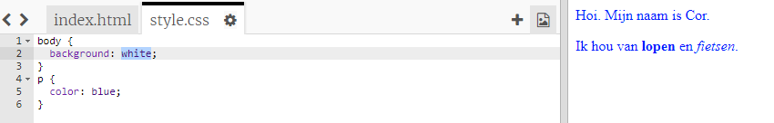

## Wat is CSS?

CSS staat voor **Cascading Style Sheets**, en het is een taal die wordt gebruikt om webpagina's te stijlen (op te maken) om ze er leuk uit te laten zien.

+ Deze code koppelt je webpagina aan een CSS-bestand - kijk of je het in de `<head>` van het HTML-document kunt vinden:


CSS geeft alle **properties (eigenschappen)** voor een bepaald label weer.

+ Klik op de `style.css` tab om de CSS-code voor je webpagina te zien.
    
    

+ Zoek deze code:

```html
p {
    color: black;
}
```

Deze CSS-code bepaalt een eigenschap voor alinea's (`p`), waarin staat dat de tekstkleur zwart moet zijn. Let op de Amerikaanse spelling voor kleur: 'color'.

+ Wijzig het woord 'black' in de CSS-code in 'blue' (blauw). Je zou de tekstkleur van alle alinea's naar blauw moeten zien veranderen.

