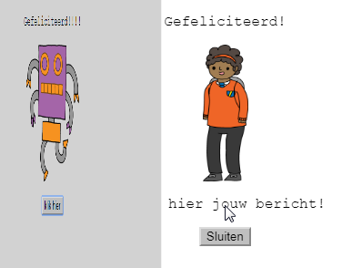
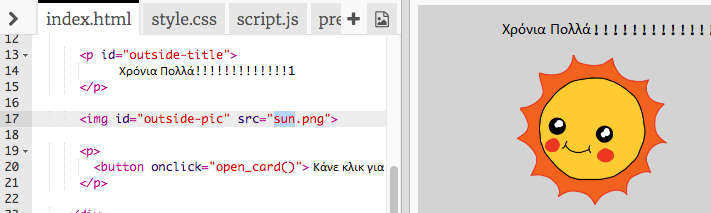
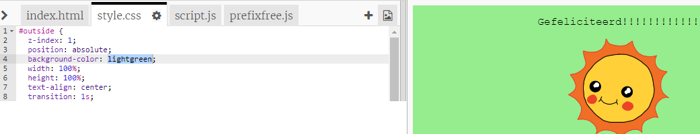
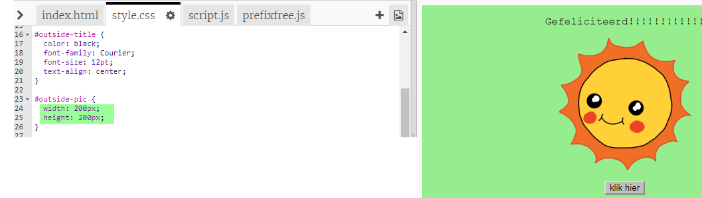
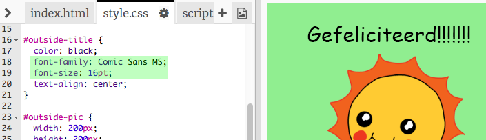

## Een verjaardagskaart maken

Laten we gebruiken wat je hebt geleerd over HTML en CSS om je eigen aangepaste verjaardagskaart te maken.

+ Open [deze trinket](https://trinket.io/html/b33e4f4ca8){:target="_blank"}.

We hebben veel code geschreven om je op weg te helpen, maar de verjaardagskaart ziet er tot nu toe vrij saai uit, dus je gaat enkele wijzigingen aanbrengen in de HTML- en CSS-code.

+ Klik op de knop aan de voorkant van de kaart en je zou hem open moeten zien gaan om de binnenkant te onthullen.

+ Ga naar regel 14 van de HTML-code. Probeer de tekst te bewerken om je kaart aan te passen.

+ Kun je de HTML-code voor de robotafbeelding vinden en de `robot` veranderen in een `zon (sun)`?

--- hints ---
 --- hint ---

+ Kijk op regel 17 om de code te vinden.
+ Verander het woord `robot` in `sun` en je ziet de afbeelding veranderen!

--- /hint ---
--- /hints ---

Je zou elk van deze woorden kunnen gebruiken `boy`, `diamond`, `dinosaur`, `flowers`, `girl`, `rainbow`, `robot`, `spaceship`, `sun`, `tea`, of `trophy` voor een verjaardagskaart of `cracker`, `elf`, `penguin`, `present`, `reindeer`, `santa`, of `snowman` als je een kerstkaart wilt maken.

Je kunt ook de CSS-code van de verjaardagskaart bewerken.

+ Klik op het tabblad voor `style.css`. Het eerste deel bevat alle CSS-stijlen voor de **outside (buitenkant)** van de kaart.

+ Verander de `background-color (achtergrondkleur)` naar `lightgreen (lichtgroen)`.

+ Je kunt ook de grootte van een afbeelding wijzigen. Ga naar de `#outside-pic` CSS-code en wijzig de breedte `with` en de hoogte `height` van de afbeelding op de buitenkant tot `200px` (`px` staat voor pixels).

+ Het lettertype kan ook gewijzigd worden. Ga naar de `#outside-title` CSS en wijzig het lettertype `font-family` in `Comic Sans MS` en de lettergrootte `font-size` in `16pt`.

Je kunt ook andere lettertypen gebruiken, bijvoorbeeld:

+ `arial`
+ `Impact`
+ `Tahoma`