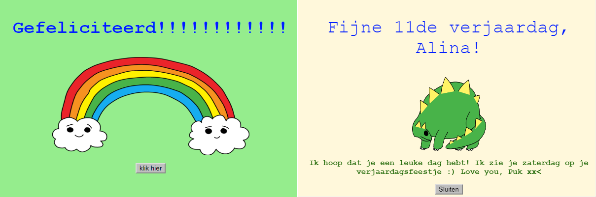
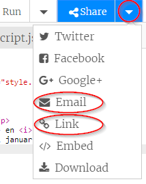

--- challenge ---

## Uitdaging: een persoonlijke kaart maken

+ Gebruik alles wat je over HTML en CSS hebt geleerd om je gepersonaliseerde kaart af te maken. En het hoeft geen verjaardagskaart te zijn, het kan een kerstkaart of een kaart voor een andere gelegenheid zijn!

Hier is een voorbeeld:

Je kunt [hier](http://jumpto.cc/colours){:target="_blank"} meer CSS kleurnamen vinden.

+ Zodra je klaar bent met jouw kaart, kunt je deze delen of naar iemand e-mailen.

--- /challenge ---