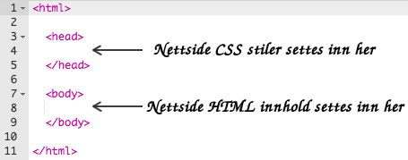
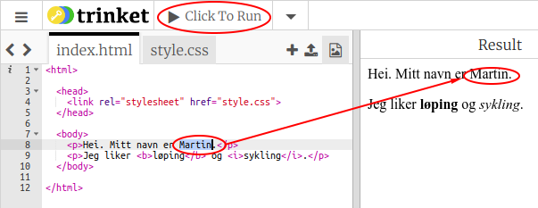
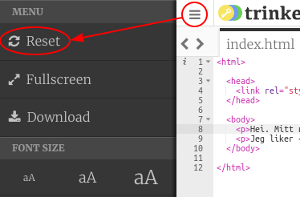
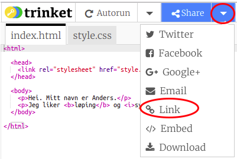
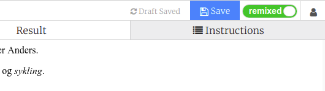

## Hva er HTML?

HTML står for **Hypertext Markup Language**, språket som brukes til å lage websider. La oss ta en titt på et eksempel!

Du vil bruke et nettsted som heter trinket.io for å skrive HTML-kode.

+ Åpne [denne trinket](http://jumpto.cc/web-intro){: target = "_ blank"}.

Prosjektet skal se slik ut:


Koden som du kan se til venstre er HTML. På høyre side av trinketen kan du se nettsiden som HTML-koden har laget.

HTML bruker koder som kalles **tagger** for å bygge nettsider. Se etter denne HTML-taggen på linje 8 i koden din:

```html
<p>Hei. Jeg heter Anders.</p>
```

`<p>` er et eksempel på en tag, og er en forkortelse for **avsnitt (paragraph på engelsk)**. Du kan starte et avsnitt med `<p>`, og avslutte et avsnitt med `</p>`.

+ Kan du se noen andre tagger?

## \--- collapse \---

## title: Svar

En annen tag du kanskje har sett er `<b>`, som står for **fet (bold)**:

```html
<b>løping</b>
```

Her er noen flere:

+ `<html>` og `</html>` markere start og slutt på HTML-dokumentet
+ `<head>` og `</head>` er der ting som CSS settes inn (vi kommer til det senere)
+ `<body>` og `</body>` er hvor innholdet på nettstedet ditt settes inn



\--- /collapse \---

+ Gjør en endring i et av avsnittene i teksten i HTML-filen (til venstre). Klikk **Run**, og du bør se endringen av nettsiden din (til høyre)!



+ Hvis du har gjort en feil og vil tilbakestille alle endringene dine, kan du klikke på **menu** knappen og deretter klikke **Reset**.



For å angre den siste tingen du gjorde, kan du trykke på `Ctrl` og `z` tastene samtidig.

### Du trenger ikke en Trinket-konto for å lagre prosjektene dine!

Hvis du ikke har en Trinket-konto, klikker du **ned**-pilen og deretter **Link**. Dette gir deg en link som du kan lagre og komme tilbake til senere. Du må gjøre dette hver gang du gjør endringer, siden linken vil endres!



Hvis du har en Trinket-konto, er den enkleste måten å lagre nettsiden din på, å klikke på **Remix** knappen på toppen av trinketen. Dette vil lagre en kopi av trinketen på profilen din.

