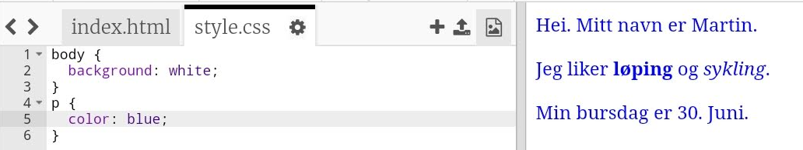

## Hva er CSS?

CSS står for **Cascading Style Sheets**, og det er et språk som brukes til å utforme nettsider og få dem til å se bra ut.

+ Denne koden kobler din nettside til en CSS-fil - se om du finner den i `<head>` av HTML-dokumentet:


CSS lister alle **egenskaper** for en bestemt tag.

+ Klikk på `style.css` fanen for å se CSS-koden for websiden din.
    
    

+ Finn denne koden:

```html
p {
    farge: svart;
}
```

Denne CSS-koden bestemmer en egenskap for avsnitt (`s.`), som sier at tekstfargen skal være svart. Legg merke til den amerikanske stavemåten: 'farge'.

+ Endre ordet "svart" i CSS-koden til "blå". Du bør se tekstfargen på alle avsnittene endres til blå.

