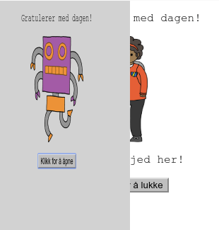
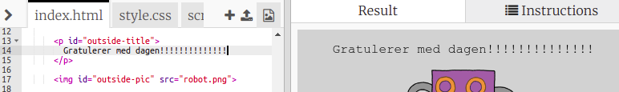
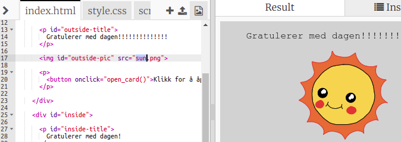
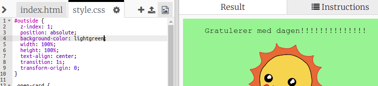
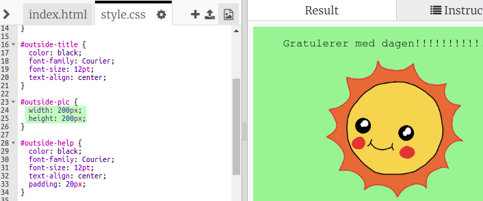
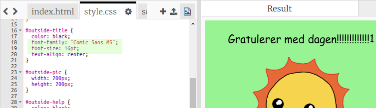

## Lag et bursdagskort

La oss bruke det du har lært om HTML og CSS for å lage ditt eget tilpassede bursdagskort.

+ Open [this trinket](https://trinket.io/html/b33e4f4ca8){:target="_blank"}.

Vi har skrevet mye kode for å komme i gang, men bursdagskortet ser ganske kjedelig ut så langt, så du skal gjøre noen endringer i HTML- og CSS-koden.

+ Klikk på knappen på forsiden av kortet, og du bør se den åpen for å avsløre innsiden.

+ Gå til linje 14 i HTML-koden. Prøv å redigere teksten for å tilpasse kortet ditt.

+ Kan du finne HTML-koden for robot-bildet, og endre ordet `robot` til `sun`?

\--- hints \--- \--- hint \---

+ Se på linje 17 for å finne koden.
+ Endre ordet `robot` til `sun`, og du vil se bildet endres!

 DO NOT TRANSLATE\--- / hint \--- \--- / hint \---

Du kan bruke noen av ordene `boy`, `diamond`, `dinosaur`, `flowers`, `girl`, `rainbow`, `robot`, `spaceship`, `sun`, `tea`, or `trophy` for a birthday card, or `cracker`, `elf`, `penguin`, `present`, `reindeer`, `santa`, or `snowman` hvis du foretrekker å lage et julekort.

Du kan også redigere CSS-koden på bursdagskortet.

+ Klikk på fanen for `style.css`. Den første delen er alle CSS-stilene for **utstiden** på kortet.

+ Endre `background-color` (bakgrunnsfarge) til `lightgreen` (lysegrønn).

+ Du kan også endre størrelsen på et bilde. Gå til `#outside-pic` CSS-koden, og endre `width` (bredde) og `height` (høyde) av utvendig bilde til `200px` (`px` står for piksler).

+ Skriften kan også endre. Gå til `#outside-title` CSS og endre `font-family` (skriftfamilie) til `Comic Sans MS` og `font-size` (skriftstørrelse) til `16pt`.

Du kan bruke andre skrifter, for eksempel:

+ `DO NOT TRANSLATE arial`
+ `DO NOT TRANSLATEImpact`
+ `DO NOT TRANSLATETahoma`