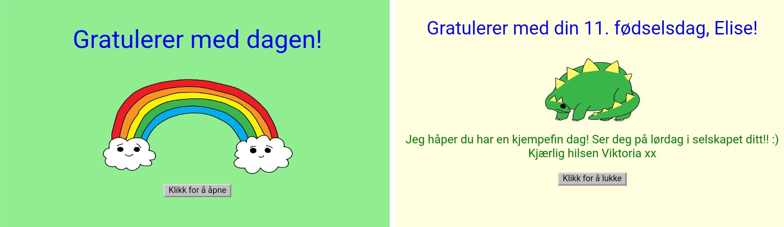
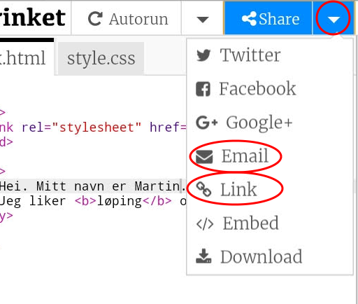

\--- utfordring \---

## Utfordring: Lag et personlig kort

+ Bruk alt du har lært om HTML og CSS for å fullføre et personlig kort. Og det trenger ikke å være et bursdagskort, det kan være en til jul eller en annen anledning!

Her er et eksempel:

Du finner flere CSS-fargenavn [her](http://jumpto.cc/colours){: target = "_ blank"}.

+ Når du er ferdig med kortet ditt, kan du dele eller sende det til noen.

\--- /utfordring \---