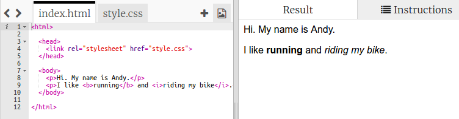
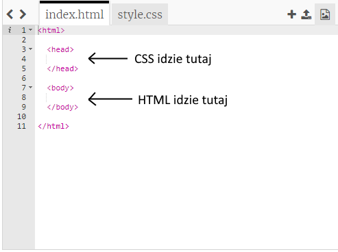
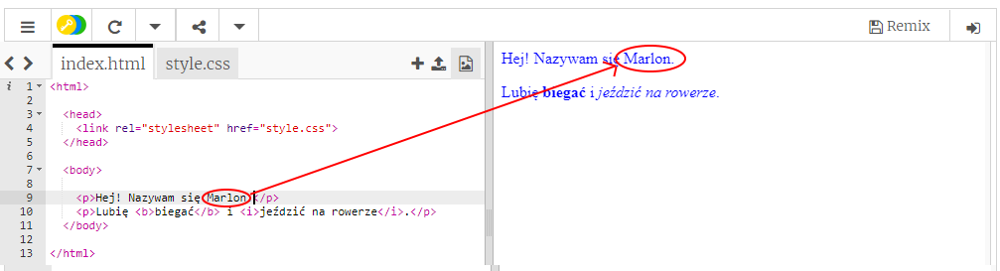
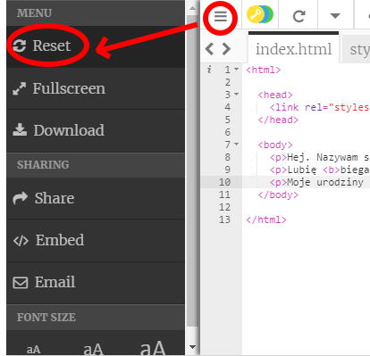
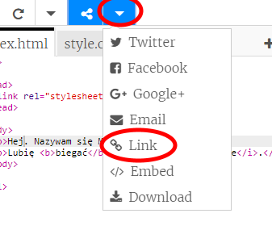
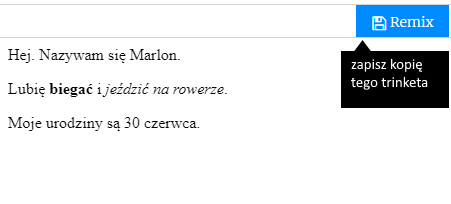

## Co to jest HTML?

HTML oznacza ** Hypertext Markup Language **, język używany do tworzenia stron internetowych. Spójrzmy na przykład!

Będziesz używać strony o nazwie trinket.io do pisania kodu HTML.

+ Otwórz [ten fragment kodu](http://jumpto.cc/web-intro){:target="_blank"}.

Projekt powinien wyglądać następująco:



Kod widoczny po lewej stronie to HTML. W panelu po prawej stronie możesz zobaczyć stronę, którą wykonał kod HTML.

HTML używa **znaczników** do tworzenia stron internetowych. Poszukaj tego kodu HTML w wierszu 8:

```html
<p>Cześć. Mam na imię Andy.</p>
```

`<p>` is an example of a tag, and is short for **paragraph**. You can start a paragraph with `<p>`, and end a paragraph with `</p>`.

+ Can you spot any other tags?

## \--- collapse \---

## title: Answer

One other tag you might have spotted is `<b>`, which stands for **bold**:

```html
<b>running</b>
```

Here are some more:

+ `<html>` and `</html>` mark the start and end of the HTML document
+ `<head>` and `</head>` is where stuff like CSS goes (we'll get to that later)
+ `<body>` and `</body>` is where your website content goes



\--- /collapse \---

+ Make a change to one of the paragraphs of text in the HTML file (on the left). Click **Run**, and you should see your webpage change (on the right)!



+ If you have made a mistake and want to undo all of your changes, you can click the **menu** button and then click **Reset**.



To undo just the last thing you did, you can press the `Ctrl` and `z` keys together.

### You don't need a Trinket account to save your projects!

If you don't have a Trinket account, click the **down** arrow and then click **Link**. This will give you a link that you can save and come back to later. You'll need to do this every time you make changes, as the link will change!



If you have a Trinket account, the easiest way to save your webpage is to click the **Remix** button on the top of the trinket. This will save a copy of the trinket on your profile.

