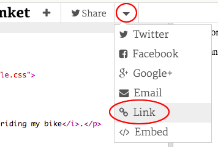

## Co to jest HTML?

HTML oznacza ** Hypertext Markup Language **, język używany do tworzenia stron internetowych. Spójrzmy na przykład!

Będziesz używać strony o nazwie trinket.io do pisania kodu HTML.

+ Otwórz [ten fragment kodu](http://jumpto.cc/web-intro){:target="_blank"}.

Projekt powinien wyglądać następująco:


Kod widoczny po lewej stronie to HTML. W panelu po prawej stronie możesz zobaczyć stronę, którą wykonał kod HTML.

HTML używa **znaczników** do tworzenia stron internetowych. Poszukaj tego kodu HTML w wierszu 8:

```html
<p>Cześć. Mam na imię Andy.</p>
```

`<p>` jest przykładem znacznika i jest skrótem od słowa **akapit**. Możesz rozpocząć akapit od `<p>` i zakończyć go za pomocą `</p>`.

+ Czy możesz dostrzec inne znaczniki?

## \--- collapse \---

## title: Odpowiedź

Innym znacznikiem jaki mogłeś zauważyć jest `<b>`, co oznacza **pogrubienie**:

```html
<b>uruchomione</b>
```

Oto kilka innych znaczników:

+ `<html>` i ` </html>` oznaczają początek i koniec dokumentu HTML
+ `<head>` i `</head>` jest miejscem, gdzie znajdują się rzeczy takie jak CSS (dotrzemy do tego później)
+ `<body>` i `</body>` to miejsce, gdzie znajduje się zawartość twojej strony


\--- /collapse \---

+ Dokonaj zmiany w jednym z akapitów tekstu w pliku HTML (po lewej). Jeśli Klikniesz **Run**, to powinieneś zobaczyć zmianę strony (po prawej)!


+ Jeśli popełniłeś błąd i chcesz cofnąć wszystkie zmiany, możesz kliknąć przycisk **menu**, a następnie kliknąć **Reset**.


Aby cofnąć ostatnią rzecz, którą zrobiłeś, naciśnij klawisze `Ctrl` i `z` jednocześnie.

### Nie potrzebujesz konta w Trinket, aby zapisać swoje projekty!

Jeśli nie masz konta Trinket, kliknij **strzałkę w dół**, a następnie kliknij **Link**. Zobaczysz link, który możesz zapisać i użyć później, aby wrócić do swojego projektu. Musisz to robić za każdym razem, gdy wprowadzisz zmiany, ponieważ link będzie się zmieniał!



Jeśli masz konto Trinket, najprostszym sposobem na zapisanie strony jest kliknięcie przycisku **Remix** na górze trinketa. Spowoduje to zapisanie kopii trinketa na Twoim profilu.

