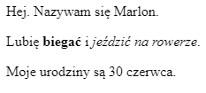

--- challenge ---

## Wyzwanie: dodaj kolejny akapit

- Czy możesz dodać trzeci akapit tekstu do swojej strony, poniżej dwóch pozostałych?

Pamiętaj, że nowy akapit powinien zaczynać się od znacznika `
`, a kończyć się znacznikiem `
`.

Tutaj jest przykład jak może wyglądać twoja strona internetowa:

Możesz dodać **pogrubienie** i <u>podkreślenie</u> tekstu do swojego nowego akapitu? Użyj znaczników `<u>` i `</u>` żeby uzyskać podkreślony tekst.

--- /challenge ---