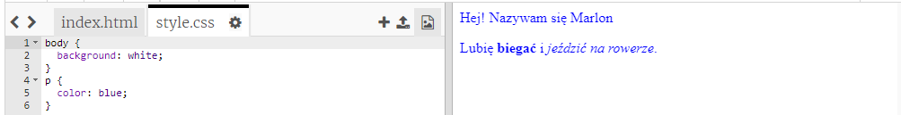

## Co to jest CSS?

CSS oznacza **Cascading Style Sheets**, jest to język używany do stylizowania stron internetowych i sprawienia, żeby wyglądały one ładniej.

+ Ten kod łączy Twoją stronę z plikiem CSS — zobacz czy możesz go znaleźć w `<head>` w dokumencie HTML:


CSS wyświetla wszystkie **właściwości** dla konkretnego znacznika.

+ Naciśnij na `style.css` tab, aby zobaczyć kod CSS twojej strony.
    
    

+ Znajdź ten kod:

```html
p {
    color: black;
}
```

Ten kod CSS określa właściwości akapitów (`p`), mówi on, że kolor tekstu powinien być czarny. Zwróć uwagę na amerykańską pisownię: „color”.

+ Zmień słowo „black” w kodzie CSS na „blue”. Powinieneś zobaczyć kolor tekstu wszystkich akapitów zmieniony na niebieski.

