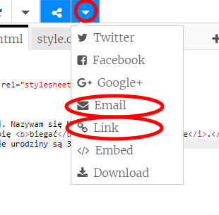

\--- challenge \---

## Wyzwanie: utwórz spersonalizowaną kartkę

+ Wykorzystaj wszystko, czego dowiedziałeś się o HTML i CSS, aby skończyć tworzenie spersonalizowanej kartki. Nie musi to być kartka urodzinowa, może ona być Bożo Narodzeniowa lub na inną okazję!

Oto przykład:

Możesz znaleźć więcej nazw kolorów CSS [tutaj](http://jumpto.cc/colours){:target="_blank"}.

+ Kiedy skończysz swoją kartkę, możesz ją udostępnić lub wysłać komuś e-mailem.

\--- /challenge \---