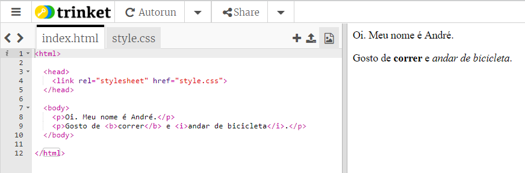
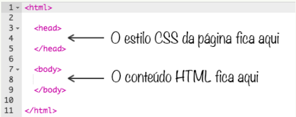
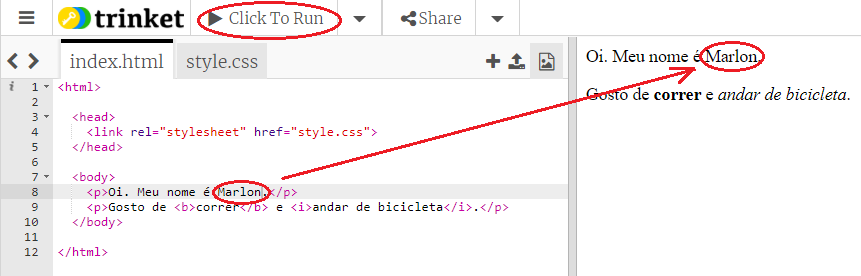
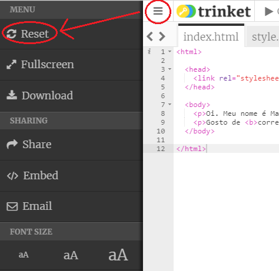
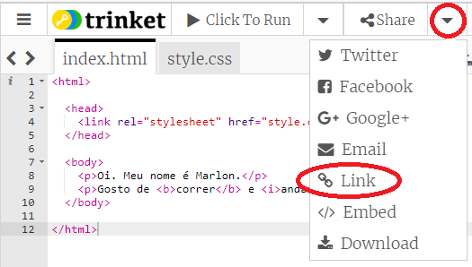
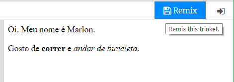

## O que é HTML?

HTML significa **Hypertext Markup Language** (Linguagem de Marcação de Hipertexto), a linguagem usada para criar páginas da web. Vamos dar uma olhada em um exemplo!

Você vai usar um site chamado trinket.io para escrever códigos HTML.

+ Abra [este trinket](http://jumpto.cc/web-intro){:target="_blank"}.

O arquivo ficará assim:



O código que você pode ver à esquerda é HTML. À direita no trinket, você pode ver a página da Web que o código HTML gerou.

O HTML usa **tags** para criar páginas da web. Procure este código HTML na linha 8 do seu código:

```html
<p>Oi. Meu nome é André.</p>
```

`<p>` é um exemplo de tag e é abreviação para **parágrafo**. Você pode iniciar um parágrafo com `<p>` e terminar um parágrafo com `</p>`.

+ Você consegue identificar outras tags?

--- collapse ---
---
title: Resposta
---

Uma outra tag que você pode ter visto é `<b>`, que significa **bold** (negrito, em inglês):

```html
<b>executando</b>
```

Aqui estão mais alguns:

+ `<html>` e ` </html>` marcam o início e o fim do documento HTML
+ `<head>` e ` </head>` é onde coisas como os códigos de CSS são inseridas (nós vamos chegar a isso mais tarde)
+ `<body>` e ` </body>` é onde vai o conteúdo de seu site



--- /collapse ---

+ Faça uma alteração em um dos parágrafos do texto no arquivo HTML (à esquerda). Clique em **Click To Run** (Clique para Executar), e você verá as mudanças na página da Web (à direita)!



+ Se você cometeu algum erro e deseja desfazer todas as alterações, clique no botão **menu** e, em seguida, clique em **Reset** (Reiniciar).



Para desfazer somente a última modificação que você fez, pressione as teclas `Ctrl` e `z` em sequência.

### Você não precisa de uma conta Trinket para salvar seus projetos!

Se você não tiver uma conta do Trinket, clique na **seta para baixo** e, em seguida, clique em **Link**. Isso lhe dará um link que você pode salvar e voltar mais tarde. Você precisará fazer isso toda vez que fizer mudanças, pois o link mudará!



Se você tiver uma conta Trinket, a maneira mais fácil de salvar sua página da Web é clicar no botão **Remix** no topo da página do trinket. Isso salvará uma cópia do trinket no seu perfil.

