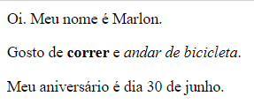

--- challenge ---

## Desafio: adicione outro parágrafo

- Você consegue adicionar um terceiro parágrafo de texto à sua página, abaixo dos outros dois?

Lembre-se de que seu novo parágrafo deve começar com uma tag `
` e terminar com uma tag `
`.

Veja aqui como sua página web deve ficar:

Você consegue adicionar texto **em negrito** e <u>sublinhado</u> a seu novo parágrafo? Use as tags `<u>` e `</u>` para texto sublinhado.

--- /challenge ---