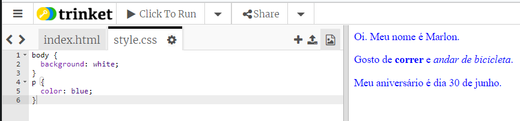

## O que é CSS?

CSS (Cascading Style Sheets) significa **Folhas de Estilo em Cascata** e é uma linguagem usada para estilizar páginas Web e torná-las bonitas.

+ Esse código vincula sua página da Web a um arquivo CSS - veja se você pode encontrá-lo no tag `<head>` do documento HTML:


O CSS lista todas as **propriedades** para uma tag específica.

+ Clique na aba `style.css` tab para ver o código CSS da sua página da web.
    
    

+ Encontre este código:

```html
p {
    color: black;
}
```

Este código CSS determina uma propriedade para parágrafos (`p`), a qual diz que a cor do texto deve ser preta. Observe a ortografia em inglês americano: 'color'.

+ Altere a palavra "black" (preto) no código CSS para "blue" (azul). Você deverá ver a cor do texto de todos os parágrafos mudar para azul.

