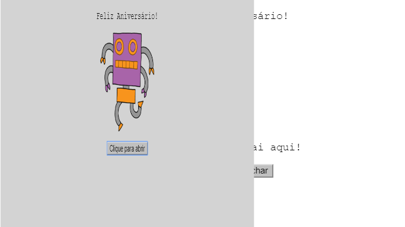
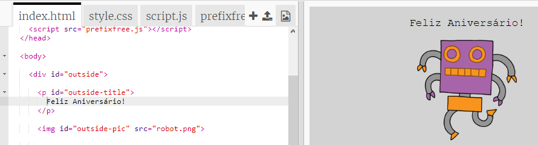
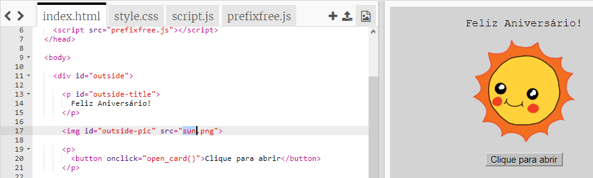
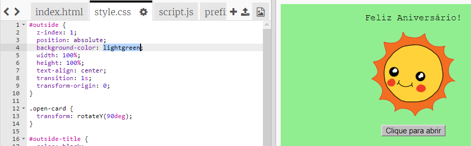
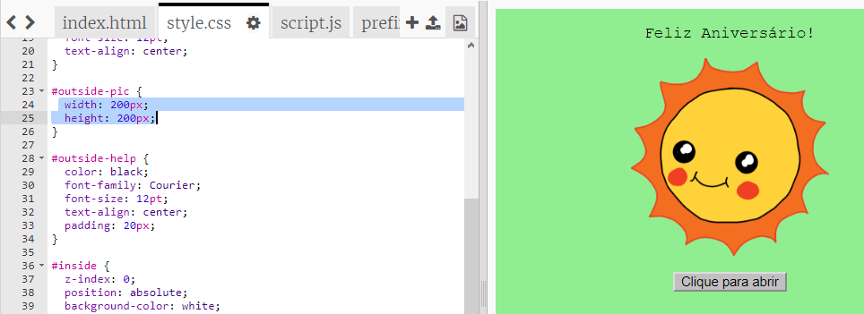
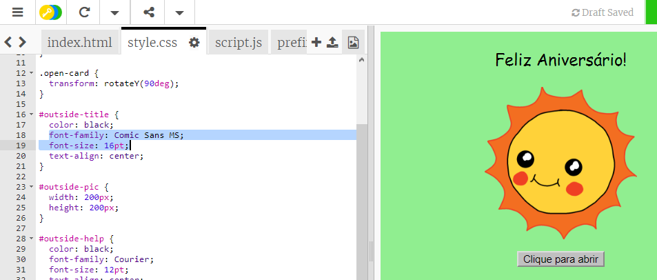

## Fazendo um cartão de aniversário

Vamos usar o que você aprendeu sobre HTML e CSS para criar seu próprio cartão de aniversário personalizado.

+ Abra [este trinket](https://trinket.io/html/d643e28ddf){:target="_blank"}.

Nós já escrevemos muito código para você pegar o jeito, mas o cartão de aniversário parece bem entediante até agora, então você vai fazer algumas mudanças no código HTML e CSS.

+ Clique no botão na capa do cartão e você o verá abrir para revelar seu interior.

+ Vá para a linha 14 do código HTML. Tente editar o texto para personalizar seu cartão.

+ Você consegue encontrar o código HTML relativo à imagem do robô e alterar a palavra `robot` (robô, em inglês) para `sun` (sol, em inglês)?

--- hints ---
 --- hint ---

+ Olhe na linha 17 para encontrar o código.
+ Altere a palavra `robot` para `sun`, e você verá a imagem mudar!

 
--- /hint ---
--- /hints ---

Você pode usar as palavras em inglês `boy` (menino), `diamond` (diamante), `dinosaur` (dinossauro), `flowers` (flores), `girl` (garota), `rainbow` (arco-íris), `robot` (robô), `spaceship` (espaçonave), `sun` (sol), `tea` (chá), ou `trophy`(troféu) para um cartão de aniversário, ou `cracker` (biscoito), `elf` (elfo), `penguin` (pinguim), `present` (presente), `reindeer` (rena), `santa` (papai noel), or `snowman` (boneco de neve) se preferir fazer um cartão de Natal.

Você também pode editar o código CSS do cartão de aniversário.

+ Clique na guia `style.css`. A primeira parte tem todos os estilos CSS para a **capa** do cartão.

+ Altere a cor de fundo `background-color` para `lightgreen` (verde claro, em inglês).

+ Você também pode alterar o tamanho de uma imagem. Vá para o Código CSS `#outside-pic` e altere `width` (a largura) e `height` (a altura) da imagem externa para `200 px` (`px` significa pixels).

+ A fonte também pode ser alterada. Vá para o CSS `#outside-title` (título exterior) e altere a `font-family` (família de fontes) para `Comic Sans MS` e o `font-size` (tamanho da fonte) para `16pt`.

Você pode usar outras fontes, por exemplo:

+ `Arial`
+ `Impact`
+ `Tahoma`