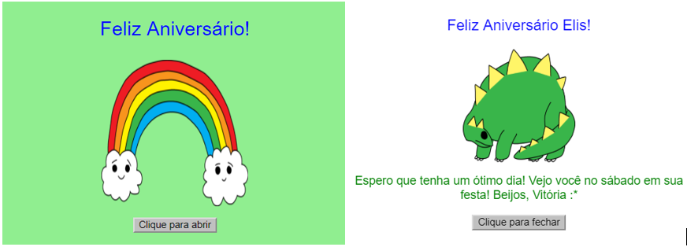

--- challenge ---

## Desafio: criar um cartão personalizado

+ Use tudo o que você aprendeu sobre HTML e CSS para terminar de criar um cartão personalizado. E não precisa ser um cartão de aniversário, pode ser um cartão de Natal ou para qualquer outra ocasião!

Aqui está um exemplo:

Você pode encontrar mais nomes de cores CSS [aqui](http://jumpto.cc/colours){:target="_blank"}.

+ Depois de terminar seu cartão, você pode compartilhar ou enviá-lo por e-mail a alguém.

---/challenge ---
***
### Tradução Contribuída pela Comunidade 

Este projeto foi traduzido por **Denis Silva** e revisado por **Robbie Fernandes**. 

Nossos incríveis voluntários de tradução nos ajudam a dar as crianças em todo o mundo a oportunidade de aprender a programar. Você pode nos ajudar a alcançar mais crianças traduzindo nossos projetos - leia mais em [rpf.io/translators](https://rpf.io/translators).
