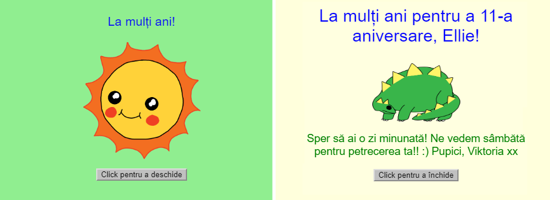

## Introducere

În acest proiect, vei fi introdus în HTML și CSS, învățând cum să îți faci propria felicitare aniversară personalizată.

### Ce vei face

Dă click pe buton pentru a deschide felicitarea:

  <iframe src="https://trinket.io/embed/html/c3d52cf65c?outputOnly=true&start=result" width="600" height="450" frameborder="0" marginwidth="0" marginheight="0" allowfullscreen>
  </iframe>
  

### Ce vei învăța

Acest proiect acoperă elemente din următoarele componente ale [Raspberry Pi Digital Making Curriculum](http://rpf.io/curriculum){:target="_blank"}:

+ [Proiectarea elementelor de bază în 2D și 3D](https://www.raspberrypi.org/curriculum/design/creator){:target="_blank"}.

### Informații suplimentare pentru educatori

Dacă vrei să printezi acest proiect, folosește [versiunea printabilă](https://projects.raspberrypi.org/en/projects/happy-birthday/print){:target="_blank"}.

Folosește link-ul din subsolul paginii pentru a accesa referința GitHub pentru acest proiect, care conține toate resursele (inclusiv un exemplu de proiect finalizat) în folder-ul „ro-RO/resources”.