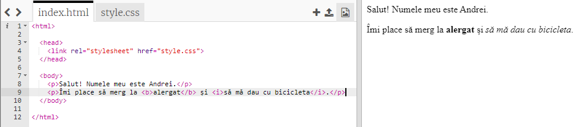
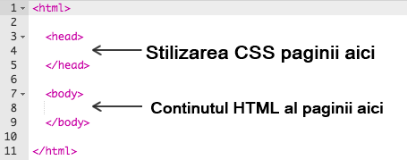
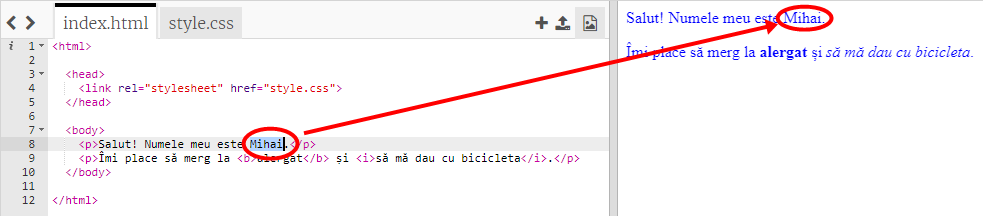

## Ce este HTML?

HTML este prescurtarea de la **Hypertext Markup Language**, limba folosită pentru a crea pagini web. Iată un exemplu!

Vei folosi un website numit trinket.io pentru a scrie cod HTML.

+ Deschide [acest trinket](http://jumpto.cc/web-intro){:target="_blank"}.

Proiectul ar trebui să arate astfel:



Codul pe care îl vezi în stânga este HTML. În dreapta trinket-ului, poți vedea pagina web pe care codul HTML a creat-o.

HTML folosește **etichete** pentru a construi pagini web. Caută codul HTML de pe linia 8 a codului tău:

```html
<p>Salut. Numele meu este Andrei.</p>
```

`<p>` este un exemplu de etichetă și este prescurtarea de la **paragraf**. Poți începe un paragraf cu `<p>` și să închei un paragraf cu `</p>`.

+ Poți găsi alte etichete?

## \--- collapse \---

## title: Răspuns

O altă etichetă pe care s-ar fi putut să o observi este `<b>`, care vine de la **bold** (în engleză, îndrăzneț):

```html
<b>alergat</b>
```

Iată câteva în plus:

+ `<html>` și `</html>` marchează începutul și sfârșitul unui document HTML
+ `<head>` și `</head>` e locul pentru lucrurile precum CSS (vom ajunge la asta mai târziu)
+ `<body>` și `</body>` este locul pentru conținutul paginii tale web



\--- /collapse \---

+ Fă o modificare pentru a schimba unul dintre paragrafele de text în fișierul HTML (din stânga). Dă click pe **Run** și vei putea vedea cum pagina ta web se schimbă (în dreapta)!



+ Dacă ai făcut o greșeală și vrei să anulezi toate modificările, poți da click pe butonul **menu** iar apoi pe **Reset**.


Pentru a anula doar ultima acțiune, poți apăsa simultan tastele `Ctrl` și `Z`.

### Nu ai nevoie de un cont Trinket pentru a-ți salva proiectele!

Dacă nu ai un cont Trinket, dă click pe săgeata **jos**, iar mai apoi pe **Link**. Acest lucru îți va oferi un link pe care îl poți salva și la care poți reveni mai târziu. Va trebui să faci acest lucru de fiecare dată când faci modificări, deoarece link-ul se va schimba!


Dacă ai un cont Trinket, cea mai ușoară modalitate de a-ți salva pagina web este de a da click pe butonul **Remix** din partea de sus a trinket-ului. Acesta va salva o copie a trinket-ului pe profilul tău.

