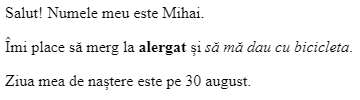

\--- challenge \---

## Provocare: adaugă alt paragraf

- Poți adăuga un al treilea paragraf de text la pagina ta web, sub celelalte două?

Nu uita că noul tău paragraf ar trebui să înceapă cu eticheta `
` și să se termine cu eticheta `
`.

Iată cum ar putea arăta pagina ta web:

Poți adăuga text **îngroșat** și <u>subliniat</u> la paragraful tău nou? Folosește etichetele `<u>` și `</u>` pentru text subliniat.

\--- /challenge \---