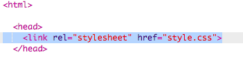

## Ce este CSS?

CSS este prescurtarea de la **Cascading Style Sheets** și este o limbă folosi pentru a stiliza paginile web și a le face mai frumoase.

+ Acest cod face legătura dintre pagina ta web și un fișier CSS — vezi dacă îl poți găsi în secțiunea `<head>` din documentul HTML:



CSS afișează toate **proprietățile** pentru o anumită etichetă.

+ Dă click pe tab-ul `style.css` pentru a vedea codul CSS pentru pagina ta web.
    
    

+ Găsește acest cod:

```html
p {
    color: black;
}
```

Acest cod CSS determină o proprietate pentru paragrafe (`p`), care spune că textul ar trebui să aibă culoarea neagră. Observă ortografia americană: „color”.

+ Schimbă cuvântul „black” din codul CSS în „blue”. Ar trebui să vezi că culoarea tuturor paragrafelor se schimbă în albastru.

