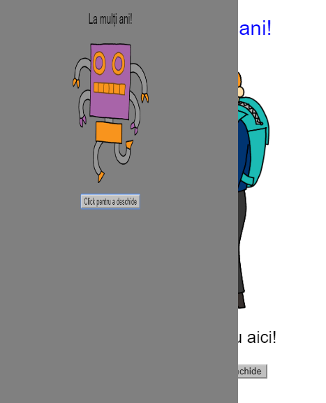
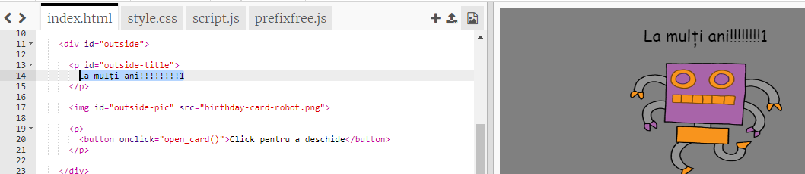
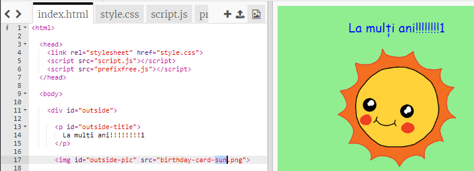
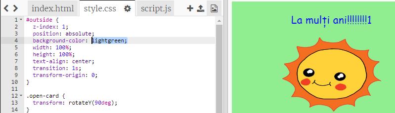
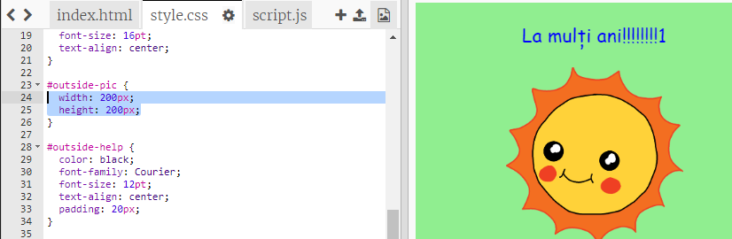

## Crearea unei felicitări aniversare

Să folosim ce ai învățat despre HTML și CSS pentru a-ți face propria felicitare aniversară personalizată.

+ Deschide [acest trinket](https://trinket.io/html/b33e4f4ca8){:target="_blank"}.

Am scris mult cod pentru început, dar felicitarea aniversară arată foarte plictisitoare până acum, așa că vei face niște schimbări în codul HTML și CSS.

+ Dă click pe butonul din fața felicitării și ar trebui să vezi cum se deschide spre exterior.

+ Mergi la linia 14 a codului HTML. Încearcă să editezi textul pentru a-ți personaliza felicitarea.

+ Poți să găsești codul HTML pentru imaginea robotului și să schimbi cuvântul `robot` în `sun` (soare)?

\--- hints \--- \--- hint \---

+ Uită-te pe linia 17 pentru a găsi codul.
+ Schimbă cuvântul `robot` în `sun` și vei vedea că se schimbă imaginea!

\--- /hint \--- \--- /hints \---

You can use any of the words `boy`, `diamond`, `dinosaur`, `flowers`, `girl`, `rainbow`, `robot`, `spaceship`, `sun`, `tea`, or `trophy` for a birthday card, or `cracker`, `elf`, `penguin`, `present`, `reindeer`, `santa`, or `snowman` if you would prefer to make a Christmas card.

You can also edit the CSS code of the birthday card.

+ Dă click pe tab-ul `style.css`. Prima parte a codului CSS este destinată stilurilor pentru **exteriorul** felicitării.

+ Schimbă `background-color` în `lightgreen`.

+ Poți schimba și dimensiunea imaginii. Mergi la codul CSS pentru `#outside-pic` și schimbă `width` (lățimea) și `height` (înălțimea) imaginii din exterior cu `200px` (`px` vine de la pixeli).

+ Fontul poate fi schimbat și el. Mergi la codul CSS pentru `#outside-title` și schimbă `font-family` la `Comic Sans MS` și `font-size` la `16pt`.

You can use other fonts, for example:

+ `arial`
+ `Impact`
+ `Tahoma`