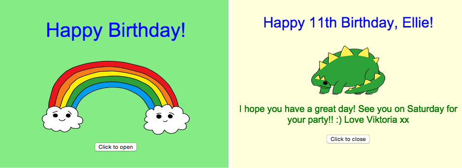

## Введение

В этом проекте вы познакомитесь с HTML и CSS и узнаете, как создать свою собственную поздравительную открытку ко дню рождения.

### Что тебе нужно будет сделать

Нажмите кнопку, чтобы открыть поздравительную открытку:

  <iframe src="https://trinket.io/embed/html/c3d52cf65c?outputOnly=true&start=result" width="600" height="450" frameborder="0" marginwidth="0" marginheight="0" allowfullscreen>
  </iframe>
  

### Чему вы научитесь

Этот проект включает в себя элементы из [Raspberry Pi Digital Making Curriculum](http://rpf.io/curriculum){:target="_blank"}:

+ [Design basic 2D and 3D assets](https://www.raspberrypi.org/curriculum/design/creator){:target="_blank"}.

### Дополнительная информация для преподавателей

Если вы хотите распечатать этот проекта, то используйте [версию для печати](https://projects.raspberrypi.org/en/projects/happy-birthday/print){: Target = «_blank»}.

Используйте ссылку внизу страницы для доступа к хранилищу GitHub, которое содержит все ресурсы (включая пример готового проекта) в папке 'en/resources'.