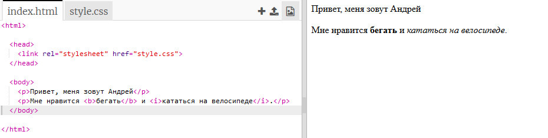
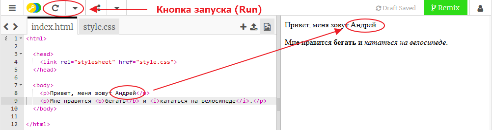
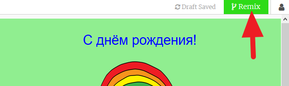

## Что такое HTML?

HTML означает **язык гипертекстовой разметки**, язык, используемый для создания веб-страниц. Давайте рассмотрим пример!

Для написания HTML-кода ты будешь использовать веб-сайт под названием trinket.io.

+ Открой [эту штуку](http://jumpto.cc/web-intro){:target="_blank"}.

Проект должен выглядеть так:



Код, который ты видишь слева, - это HTML. Справа от брелка ты можешь увидеть веб-страницу, которую сделал HTML-код.

Для создания веб-страниц на HTML используются **теги**. Взгляни на HTML-код в восьмой строке:

```html
<p>Привет. Меня зовут Андрей.</p>
```

`<p>`Это пример тега. "p" - это сокращение от английского слова **paragraph** (Абзац). Абзац начинается с тега `<p>` и заканчивается тегом `</p>`.

+ Можешь ли ты опознать какие-нибудь ещё теги?

## \--- collapse \---

## title: Answer

Тебе явно удалось заметить этот тег `<b>`. Он означает **полужирный (bold)**:

```html
<b>бегать</b>
```

Вот еще несколько:

+ `<html>` и `</html>` обозначают начало и конец HTML-документа
+ `<head>` и `</head>` предназначены для вещей. вроде CSS (мы к ним доберёмся попозже)
+ `<body>` и `</body>` - здесь размещается всё основное содержимое веб-страницы


\--- /collapse \---

+ Внеси изменения в один из абзацев текста в HTML-файле (слева). Нажми **Run (Запустить)** и ты увидишь изменение в своей веб-странице (справа)!



+ Если ты допустишь ошибку и захочешь отменить все свои изменения, то ты можешь нажать **menu** (меню), а затем **Reset** (Сброс).


Чтобы отменить только твоё последнее действие, можно одновременно нажать клавиши `Ctrl` и `z` (обычно сначала нажимают клавишу Ctrl, держат её нажатой и дальше нажимают Z, после чего отпускают обе клавиши).

### Для сохранения твоих проектов тебе не нужна учетная запись сервиса Trinket!

Если у тебя нет учетной записи Trinket, то нажми клавишу со стрелкой **вниз**, затем нажми на **Link (Ссылка)**. Так ты получишь ссылку, которую ты сможешь сохранить и вернуться к ней позже. Тебе придётся делать это после каждого созданного изменения, так как ссылка будет меняться после каждого из них!


Если же у тебя есть учетная запись Trinket, то самым простым способом сохранить твою веб-страницу является щелчок на **Remix**, находящейся вверху. Это сохранит копию проекта в твоём профиле.

