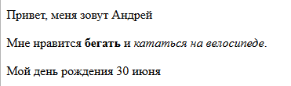

\--- challenge \---

## Задача: добавить еще один абзац

- Можешь ли ты добавить третий абзац текста на свою веб-страницу, чтобы он был ниже двух других?

Помни, что твой новый абзац будет начинаться тегом `
` и заканчиваться тегом `
`.

Вот как выглядит твоя веб-страница:

Можешь ли ты добавить в свой новый абзац **полужирный (bold)** и <u>подчёркнутый (underlined)</u> текст? Для подчёркнутого текста используй теги `<u>` и `</u>`.

\--- /challenge \---