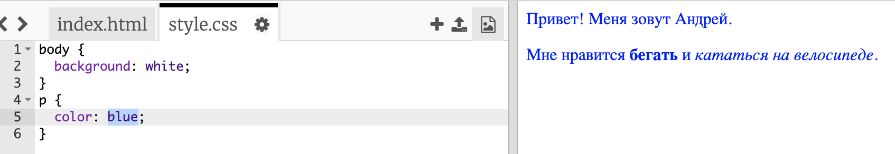

## Что такое CSS?

CSS означает **Cascading Style Sheets** (каскадные таблицы стилей). Это язык, используемый для оформления внешнего вида веб-страниц.

+ Этот код связывает твою веб-страницу с файлом CSS — посмотри-ка, можешь ли ты найти его в блоке `<head>` HTML-документа:


В CSS указываются все **свойства** для конкретного тега.

+ Нажми на вкладку `style.css` для просмотра кода CSS для твоей веб-страницы.
    
    

+ Найди этот код:

```html
p {
    color: black;
}
```

Этот CSS-код определяет свойство для абзацев (`p`), в котором говорится, что цвет текста должен быть черным.

+ Измени в коде CSS слово «black» (чёрный) на «blue» (синий). Цвет текста всех абзацев должен поменяться на синий.

