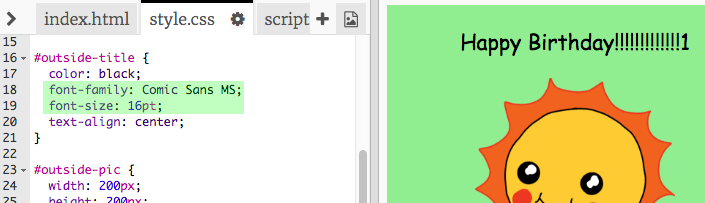

## Создание открытки ко дню рождения

Давай используем то, что ты уже знаешь о HTML и CSS, чтобы создать свою собственную открытку.

+ Открой [этот trinket](https://trinket.io/html/b6a68a067f){:target="_blank"}.

Вначале мы написали много кода, но открытка ко дню рождения выглядит довольно скучной, поэтому тебе нужно внести некоторые изменения в код HTML и CSS.

+ Нажми кнопку на лицевой стороне открытки, и открытка должна открываться, показывая своё содержимое.

+ Перейди к строке 14 HTML-кода. Попробуй отредактировать текст, чтобы получилось что-то своё.

+ Можешь ли ты найти код HTML для изображения робота и заменить слово `robot` (робот) словом `sun` (солнце)?

--- hints ---
 --- hint ---

+ Посмотри на строку 17, чтобы найти код.
+ Замени слово `robot` (робот) на слово `sun` (солнце) и ты увидишь, как изменится изображение!

--- /hint ---
--- /hints ---

Ты можешь использовать любое из следующих слов для открытки ко дню рождения: `boy` (мальчик), `diamond` (брильянт), `dinosaur` (динозавр), `flowers` (цветы), `girl` (девочка), `rainbow` (радуга), `robot` (робот), `spaceship` (космический корабль), `sun` (Солнце), `tea` (чай) или, если ты хочешь сделать рождественскую открытку, то используй эти: `trophy` (награда), `cracker` (печенье), `elf` (эльф), `penguin` (пингвин), `present` (подарок), `reindeer` (северный олень), `santa` (Санта-Клаус) или `snowman` (снеговик).

Ты также можешь отредактировать CSS-код своей открытки.

+ Нажми на вкладку `style.css`. Первая часть — это все стили CSS для **внешней** части открытки.

+ Измени значение тега `background-color` (цвет фона) на `lightgreen` (салатовый).

+ Ты также можешь изменить размер изображения. Перейди к блоку `#outside-pic` и измени значение тегов `width` (ширина) и `height` (высота) для картинки на обложке до `200px` (`px` обозначает пиксели).

+ Также можно изменить шрифт. Перейди к правилу `#outside-title` и измени значение свойства `font-family` (гарнитура шрифта, то есть название семьи шрифтов) на `Comic Sans MS` и `font-size` (кегль или размер шрифта) на `16pt`.

Ты можешь использовать и другие шрифты, например:

+ `Arial`
+ `Impact`
+ `Tahoma`