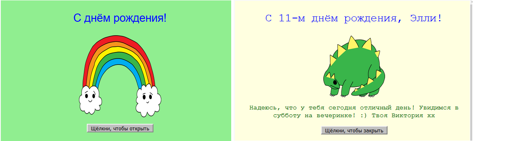

--- challenge ---

## Задача: создать персонализированную открытку

+ Используй всё, что тебе стало известно о HTML и CSS, чтобы закончить создание своей особенной открытки. Эта открытка не обязательно должна быть ко дню рождения, она может быть посвящена Рождеству или другому празднику или событию!

Вот пример:

Ты можешь найти больше названий цветов CSS [здесь](http://jumpto.cc/colours){:target="_blank"}.

+ После того, как ты закончил создание своей открытки, ты можешь поделиться ею в сети или отправить кому-нибудь по электронной почте.

--- /challenge ---

**Перевод силами сообщества**

Этот проект для вас подготовили: переводчик: **алексей карпенко**, корректор: **Илья Петров**.

Наши замечательные переводчики-добровольцы помогают нам дать детям со всего мира шанс научиться программировать. Ты можешь помочь нам привлечь больше детей, помогая переводить наши проекты. Подробнее на rpf.io/translators.