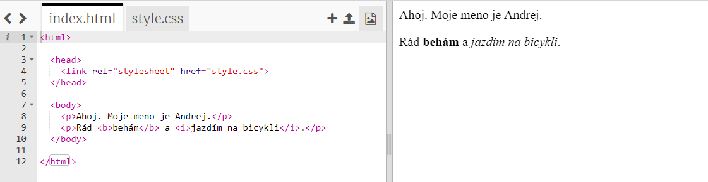
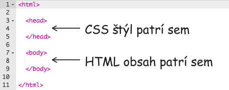
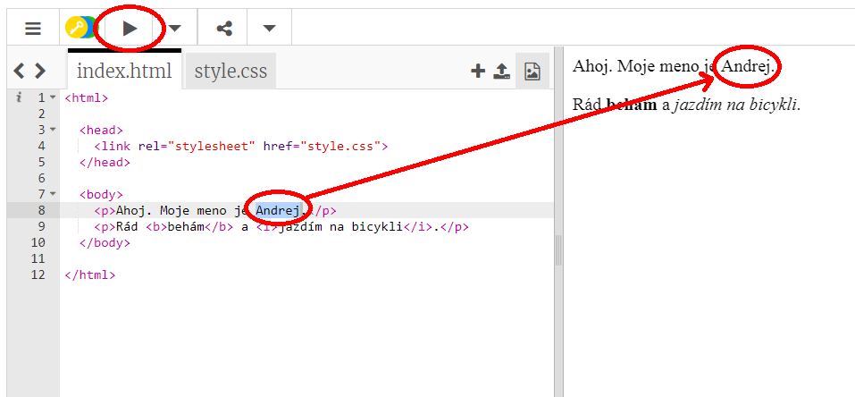
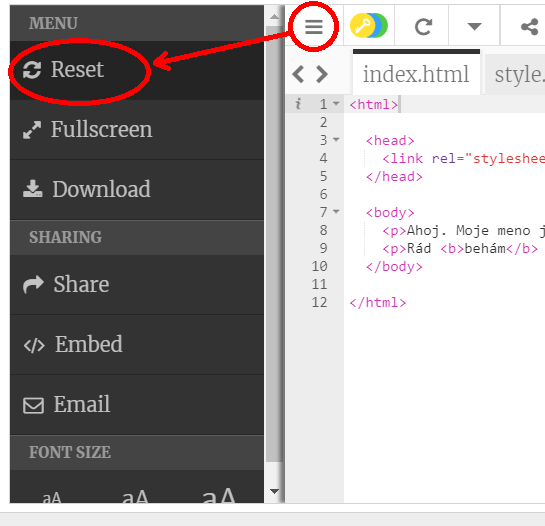
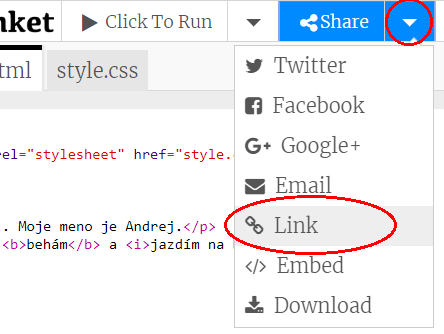
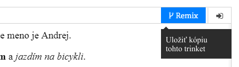

## Čo je HTML?

HTML znamená **Hypertextový značkovací jazyk (z angl. Hypertext Markup Language)**, jazyk používaný na vytváranie webových stránok. Poďme sa pozrieť na príklad!

Na napísanie HTML kódu budete používať webovú stránku nazvanú trinket.io.

+ Otvorte [tento trinket](http://jumpto.cc/web-intro){:target="_blank"}.

Projekt by mal vyzerať takto:



Kód, ktorý môžete vidieť na ľavej strane, je HTML. V pravej časti trinket-u môžete vidieť webovú stránku, ktorú kód HTML vytvoril.

Jazyk HTML využíva **značky, tzv. tagy** na vytváranie webových stránok. Všimnite si tento 8 riadok vášho HTML kódu:

```html
<p>Ahoj. Moje meno je Andrej.</p>
```

`<p>` je príkladom značky, ktorá označuje krátky **odsek**. Odsek môžete začať s `<p>` a ukončiť ho s `</p>`.

+ Dokážete nájsť ďalšie značky?

## \--- collapse \---

## title: Odpoveď

Ďalšia značka, ktorú ste možno zaznamenali, je `<b>`, ktorá označuje **tučné písmo**:

```html
<b>beh</b>
```

Tu sú niektoré ďalšie:

+ `<html>` a `</html>` označujú začiatok a koniec HTML dokumentu
+ `<head>` a `</head>` označujú miesto, kde vkladáme napríklad CSS (k tomu sa dostaneme neskôr)
+ `<body>` a `</body>` označuje miesto, kde sa nachádza obsah vašej webovej stránky



\--- /collapse \---

+ Zmeňte jeden z odsekov textu v súbore HTML (vľavo). Kliknite na tlačidlo **Spustiť** a mali by ste vidieť zmenu vašej webovej stránky (vpravo)!



+ Ak ste urobili chybu a chcete vrátiť všetky svoje zmeny späť, môžete kliknúť na **hlavnú ponuku** a následne na tlačidlo **Reset**.



Ak chcete vrátiť späť iba poslednú vec, ktorú ste urobili, stlačte spolu klávesy `Ctrl` a `z`.

### Nepotrebujete účet Trinket na ukladanie projektov!

Ak nemáte účet Trinket, kliknite na šípku **nadol** a potom na **Link**. Dostanete odkaz, ktorý môžete uložiť a neskôr pomocou neho vrátiť. Budete to musieť urobiť zakaždým, keď vykonáte zmeny, pretože odkaz sa zmení!



Ak máte účet Trinket, najjednoduchší spôsob, ako uložiť vašu webovú stránku, je kliknúť na tlačidlo **Remix** v hornej časti. Tým sa uloží kópia trinket stránky vo vašom profile.

