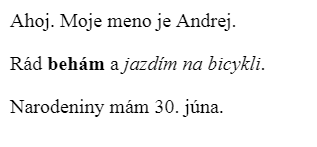

\--- challenge \---

## Výzva: pridaj ďalší odsek

- Dokážeš na svoju webovú stránku pridať pod predošlé dva odseky tretí?

Nezabúdaj, že nový odsek by sa mal začínať značkou `
` a končiť s `
`.

Takto by mohla vyzerať tvoja webová stránka:

Dokážeš do nového odseku pridať **hrubé písmo** a <u>podčiarknutý</u> text? Na podčiarknutie textu použi značky `<u>` a `</u>`.

\--- /challenge \---