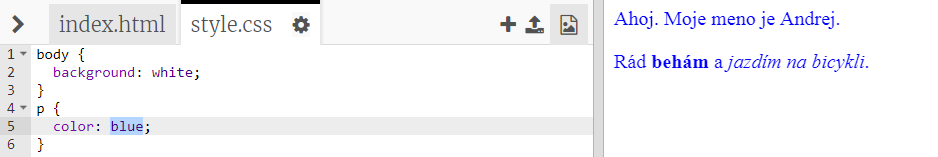

## Čo je CSS?

CSS je označenie pre **Kaskádové štýly (z angl. Cascading Style Sheets)** a je to jazyk používaný na vytváranie pekného vzhľadu webových stránok.

+ Tento kód prepája tvoju webovú stránku s CSS súborom. Skús ho nájsť v HTML dokumente v časti `<head>`:


CSS uvádza všetky **vlastnosti** pre príslušnú značku.

+ Klikni na záložku `style.css` a zobrazí sa ti CSS kód tvojej webovej stránky.
    
    

+ Nájdi tento kód:

```html
p {
    color: black;
}
```

Tento kód CSS určuje vlastnosť odsekov (`p`) a hovorí, že farba textu by mala byť čierna. Všimni si americký pravopis: 'color'.

+ V CSS kóde zmeň slovo 'black' na 'blue'. Farba textu vo všetkých odsekoch by sa mala zmeniť na modrú.

