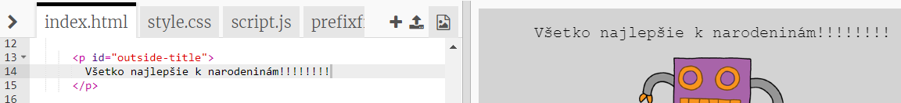
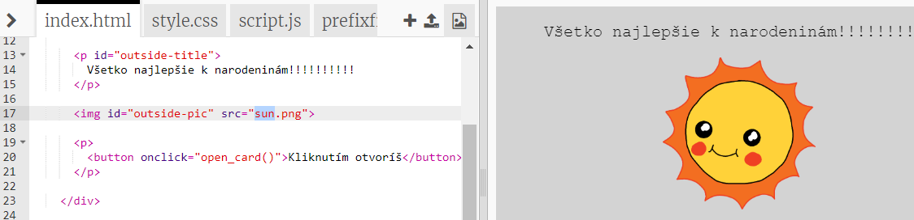
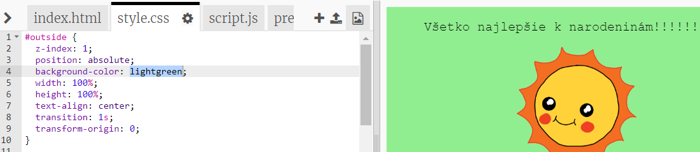
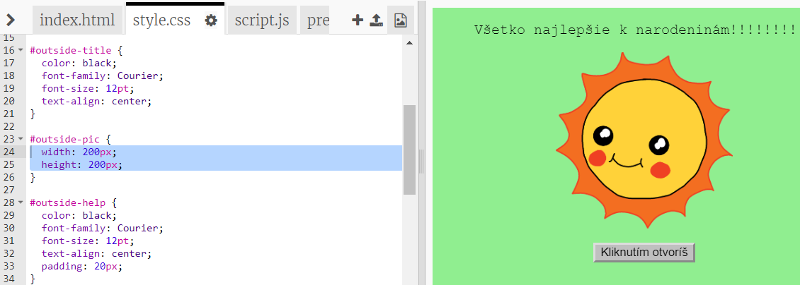
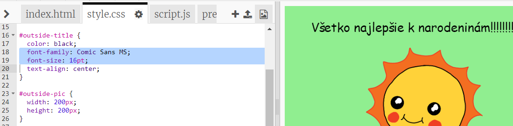

## Tvorba narodeninového pozdravu

Vytvor si vlastný narodeninový pozdrav pomocou toho, čo si sa naučil/-a o HTML a CSS.

+ Otvor [tento trinket](https://trinket.io/html/b33e4f4ca8){:target="_blank"}.

Hoci sme pre teba na začiatok napísali veľa kódu, narodeninový pozdrav stále vyzerá dosť nudne. V HTML a CSS kóde preto urobíme zopár zmien.

+ Klikni na tlačidlo na prednej strane pozdravu. Tým ho otvoríš a pozrieš sa, čo je vnútri.

+ V HTML kóde prejdi do riadku 14. Skús upraviť text, aby si si pozdrav prispôsobil/-a svojej predstave.

+ Dokážeš vo svojom HTML kóde nájsť obrázok robota a zmeniť slovo `robot` na `sun`?

\--- hints \--- \--- hint \---

+ Kód nájdeš v riadku 17.
+ Zmeň slovo `robot` na `sun` a uvidíš, ako sa obrázok zmení!

\--- /hint \--- \--- /hints \---

You can use any of the words `boy`, `diamond`, `dinosaur`, `flowers`, `girl`, `rainbow`, `robot`, `spaceship`, `sun`, `tea`, or `trophy` for a birthday card, or `cracker`, `elf`, `penguin`, `present`, `reindeer`, `santa`, or `snowman` if you would prefer to make a Christmas card.

You can also edit the CSS code of the birthday card.

+ Klikni na záložku `style.css`. V prvej časti sú všetky CSS štýly pre **vonkajšiu** časť pozdravu.

+ Zmeň farbu pozadia `background-color` na svetlozelenú - `lightgreen`.

+ Taktiež môžeš zmeniť veľkosť obrázka. V CSS kóde prejdi do časti `#outside-pic` a zmeň šírku - `width` a výšku - `height` vonkajšieho obrázka na `200px` (`px` označuje pixely).

+ Môžeš tiež zmeniť typ a veľkosť písma. V CSS kóde prejdi do časti `#outside-title` a zmeň `font-family` na `Comic Sans MS` a veľkosť písma `font-size` na `16pt`.

You can use other fonts, for example:

+ `arial`
+ `Impact`
+ `Tahoma`