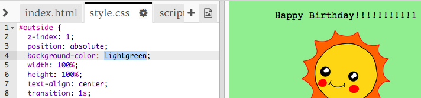

## Tvorba blahoželania

Využite to, čo ste sa naučili o HTML a CSS, aby ste vytvorili svoj vlastný narodeninový pozdrav.

+ Otvorte [tento trinket](http://jumpto.cc/web-card){:target="_blank"}.

Napísali sme veľa kódu, aby ste mohli začať, ale narodeninové blahoželanie vyzerá dosť nudne. Urobíme preto nejaké zmeny v kóde HTML a CSS.

+ Kliknite na tlačidlo na prednej strane pozdravu. Tým pozdrav otvoríte a odkryjete jeho vnútornú stranu.

+ Prejdite na 14 riadok HTML kódu. Skúste upraviť text, aby ste ho prispôsobili vašej predstave blahoželania.

+ Dokážete nájsť vo vašom HTML kóde obrázok robota a zmeniť slovo `robot` na `sun`?

\--- hints \--- \--- hint \---

+ Pozrite sa na 17 riadok, kde nájdete kód.
+ Zmeňte slovo `robot` na `sun` a uvidíte zmenu obrázka na slnko!

 \--- /hint \--- \--- /hints \---

Môžete použiť akékoľvek slovo `boy`, `diamond`, `dinosaur`, `flowers`, `girl`, `rainbow`, `robot`, `spaceship`, `sun`, `tea`, alebo `trophy` pre narodeninový pozdrav, alebo `cracker`, `elf`, `penguin`, `present`, `reindeer`, `santa`, alebo `snowman` ak máte radšej Vianočné pozdravy.

Môžete tiež upraviť CSS kód narodeninového blahoželania.

+ Kliknite na kartu `style.css`. V prvej časti sú všetky CSS štýly pre **vonkajšiu** časť pozdravu.

+ Zmeňte farbu pozadia `background-color` na svetlozelenú - `lightgreen`.

+ Taktiež môžete zmeniť veľkosť obrázka. Go to the `#outside-pic` CSS code, and change the `width` and `height` of the outside image to `200px` (`px` stands for pixels).

+ The font can be changed too. Go to the `#outside-title` CSS and change the `font-family` to `Comic Sans MS` and the `font-size` to `16pt`.

You can use other fonts, for example:

+ `arial`
+ `Impact`
+ `Tahoma`