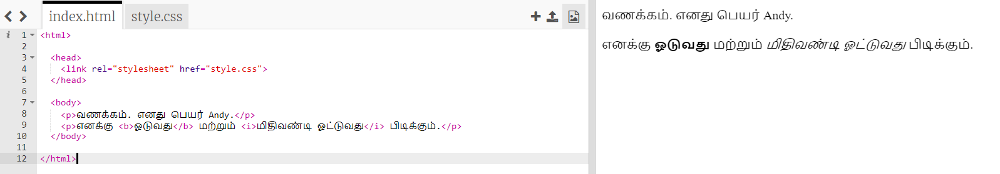
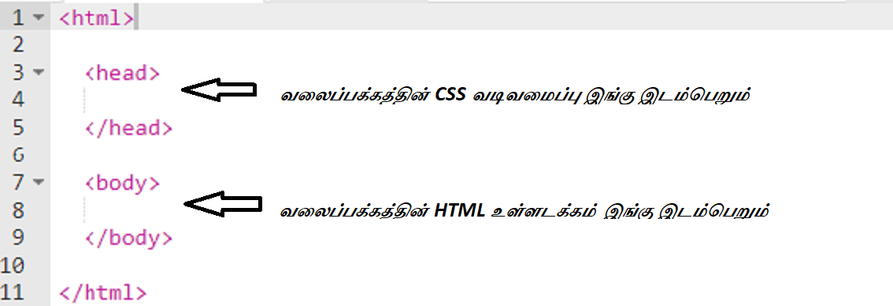
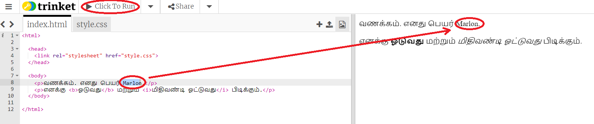
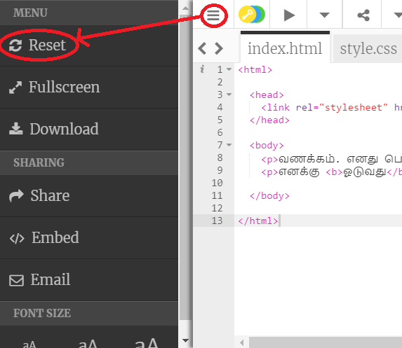
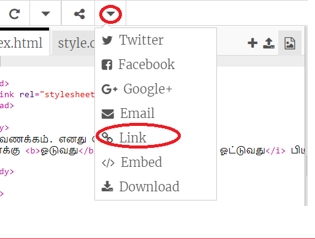
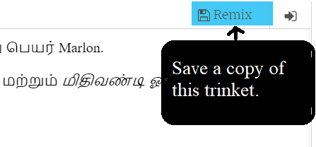

## HTML என்றால் என்ன?

HTML என்பது **Hypertext Markup Language** மொழியைக் குறிக்கிறது, இது வலைப்பக்கங்களை உருவாக்க பயன்படும் மொழி. ஒரு உதாரணத்தைப் பார்ப்போம்!

HTML குறியீட்டை எழுத trinket.io என்ற வலைத்தளத்தை பயன்படுத்துவீர்கள்.

+ [இந்த trinket இணையதள இணைப்பை](http://jumpto.cc/web-intro){:target="_blank"} திறக்கவும்.

இந்த திட்டம் இதுபோன்றதாக இருக்கும்:



இடதுபுறத்தில் நீங்கள் காணக்கூடிய குறியீடு HTML ஆகும். வலதுபுறத்தில், HTML குறியீடு உருவாக்கிய வலைப்பக்கத்தைக் காணலாம்.

HTML uses **tags** to build webpages. Look for this HTML code on line 8 of your code:

```html
<p>Hi. My name is Andy.</p>
```

`<p>` is an example of a tag, and is short for **paragraph**. You can start a paragraph with `<p>`, and end a paragraph with `</p>`.

+ Can you spot any other tags?

## \--- collapse \---

## பதில்

One other tag you might have spotted is `<b>`, which stands for **bold**:

```html
<b>running</b>
```

மேலும் சில இங்கே கொடுக்கப்பட்டுள்ளது:

+ `<html>` மற்றும் ` </html>` HTML ஆவணத்தின் தொடக்கத்தையும் முடிவையும் குறிக்கின்றது
+ `<head>` and `</head>` is where stuff like CSS goes (we'll get to that later)
+ `<body>` and `</body>` is where your website content goes



\--- /collapse \---

+ Make a change to one of the paragraphs of text in the HTML file (on the left). Click **Run**, and you should see your webpage change (on the right)!



+ If you have made a mistake and want to undo all of your changes, you can click the **menu** button and then click **Reset**.



To undo just the last thing you did, you can press the `Ctrl` and `z` keys together.

### உங்கள் திட்டங்களை சேமிக்க உங்களுக்கு Trinket கணக்கு தேவையில்லை!

If you don't have a Trinket account, click the **down** arrow and then click **Link**. This will give you a link that you can save and come back to later. You'll need to do this every time you make changes, as the link will change!



If you have a Trinket account, the easiest way to save your webpage is to click the **Remix** button on the top of the trinket. This will save a copy of the trinket on your profile.

