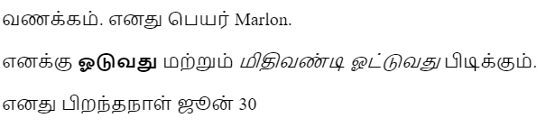

--- challenge ---

## சவால்: மற்றொரு பத்தி சேர்க்கவும்

- உங்கள் வலைப்பக்கத்தில் உரையின் மூன்றாவது பத்தியை மற்ற இரண்டு பத்திகளின் கீழே சேர்க்க முடியுமா?

உங்கள் புதிய பத்தி `
` என்ற குறிச்சொல்லுடன் தொடங்கி, `
` என்ற குறிச்சொல்லுடன் முடிவடையும் என்பதை நினைவில் கொள்ளுங்கள்.

உங்கள் வலைப்பக்கம் எப்படி இருக்கும் என்பதை இங்கே காணலாம்:

உங்களால் **தடிமனான** மற்றும் <u>அடிக்கோடிட்ட</u> உரையை உங்கள் புதிய பத்தியில் சேர்க்க முடியுமா? `<u>` மற்றும் `</u>` குறிச்சொற்களை அடிக்கோடிட்ட உரைக்காக பயன்படுத்தவும்.

--- /challenge ---