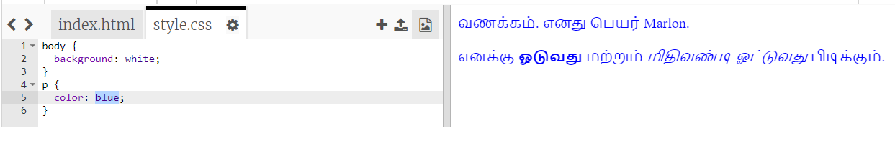

## CSS என்றால் என்ன?

CSS என்பது **Cascading Style Sheets** ஐக் குறிக்கிறது, இது வலைப்பக்கங்களின் பாணியை வடிவமைப்பதற்கு மற்றும் அழகாக மாற்றுவதற்கு பயன்படுத்தப்படும் ஒரு மொழி.

+ இந்தக் குறியீடு உங்கள் வலைப்பக்கத்தை ஒரு CSS கோப்போடு இணைக்கிறது - இதை HTML ஆவணத்தின் `<head>` இல் கண்டுபிடிக்க முடிகிறதா என்று பாருங்கள்:


CSS ஒரு குறிப்பிட்ட குறிச்சொல்லின் அனைத்து **பண்புகளையும்** பட்டியலிடுகிறது.

+ `style.css` ஐ கிளிக் செய்வதன் மூலம் உங்கள் வலைப்பக்கத்திற்கான CSS குறியீட்டைக் காணலாம்.
    
    

+ இந்த குறியீட்டைக் காண்க:

```html
p {
    color: black;
}
```

இந்த CSS குறியீடு பத்திகளுக்கான(`p`) ஒரு பண்பை தீர்மானிக்கிறது, இது உரையின் நிறம் கருப்பாக இருக்க வேண்டும் என்று கூறுகிறது. இங்கு அமெரிக்கன் முறை எழுத்தாக்கத்தை கவனியுங்கள்: 'color'.

+ CSS குறியீட்டில் உள்ள 'black' என்ற வார்த்தையை 'blue' என்று மாற்றவும். எல்லா பத்திகளில் உள்ள உரையின் நிறமும் நீல நிறமாக மாறுவதை நீங்கள் காண முடியும்.

