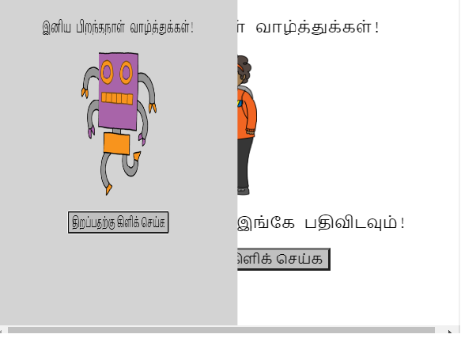
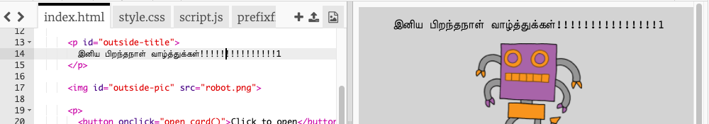
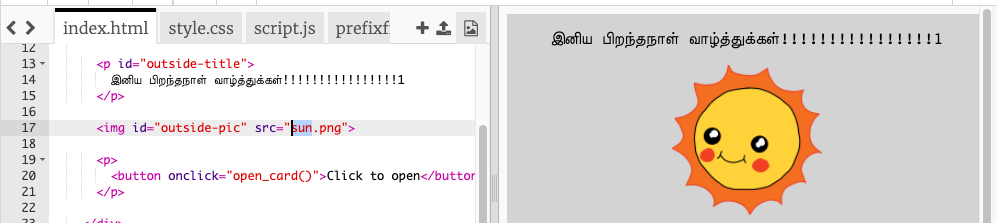
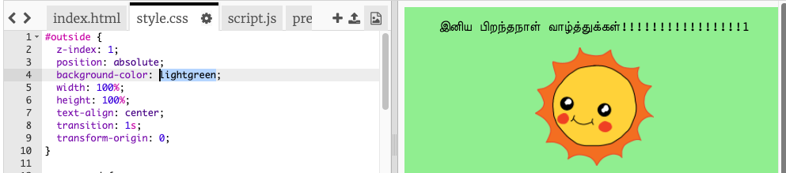
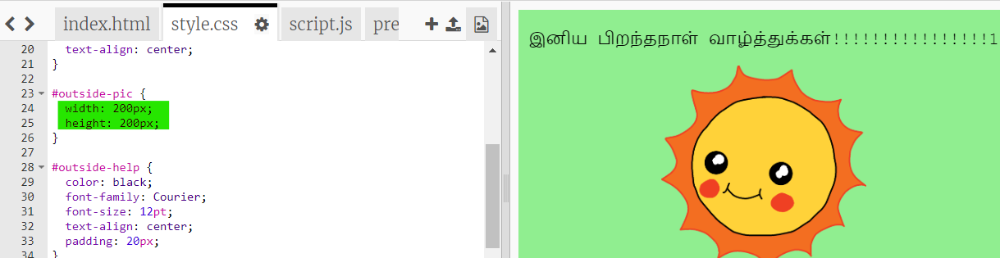
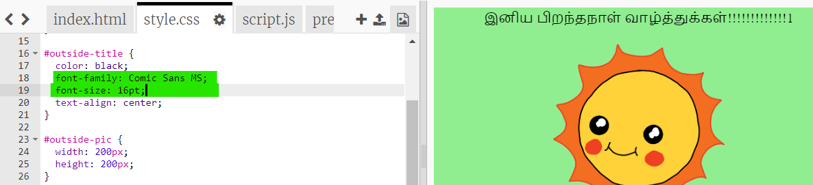

## பிறந்தநாள் அட்டையை உருவாக்குதல்

உங்கள் சொந்த தனிப்பயனாக்கப்பட்ட பிறந்தநாள் அட்டையை உருவாக்க HTML மற்றும் CSS பற்றி நீங்கள் கற்றுக்கொண்டதைப் பயன்படுத்தலாம்.

+ [இந்த trinket இணையதள இணைப்பை](https://trinket.io/html/473aed52c1){:target="_blank"} திறக்கவும்.

நீங்கள் தொடங்குவதற்கு நாங்கள் நிறைய குறியீடுகளை எழுதியுள்ளோம், ஆனால் பிறந்தநாள் அட்டை இதுவரை மிகவும் சாதாரணமாக இருக்கிறது, எனவே நீங்கள் HTML மற்றும் CSS குறியீட்டில் சில மாற்றங்களைச் செய்யப் போகிறீர்கள்.

+ அட்டையின் முன்பக்கத்தில் உள்ள பொத்தானைக் கிளிக் செய்க, உள்ளே இருப்பதை வெளிப்படுத்த அது திறப்பதைப் பார்க்கலாம்.

+ உங்கள் அட்டையைத் தனிப்பயனாக்க HTML குறியீட்டின் 14 வது வரிக்குச் சென்று உரையை மாற்றிப் பார்க்கவும்.

+ உங்களால் ரோபோ படத்திற்கான HTML குறியீட்டைக் கண்டுபிடித்து, `robot` என்ற வார்த்தையை `sun` என மாற்ற முடியுமா?

--- hints ---
 --- hint ---

+ குறியீட்டைக் கண்டுபிடிக்க 17 வது வரியில் பாருங்கள்.
+ `robot` என்ற வார்த்தையை `sun` என மாற்றவும், பின்பு படம் மாறுவதைக் காண்பீர்கள்!

--- /hint --- --- /hints ---

நீங்கள் பிறந்தநாள் அட்டைக்கு பின்வரும் சொற்களில் எதை வேண்டுமானாலும் பயன்படுத்தலாம் `boy`, `diamond`, `dinosaur`, `flowers`, `girl`, `rainbow`, `robot`, `spaceship`, `sun`, `tea`, `trophy`, அல்லது நீங்கள் ஒரு கிறிஸ்துமஸ் அட்டையை உருவாக்க விரும்பினால் பின்வரும் சொற்களில் எதை வேண்டுமானாலும் பயன்படுத்தலாம் `cracker`, `elf`, `penguin`, `present`, `reindeer`, `santa`, `snowman`.

பிறந்தநாள் அட்டையின் CSS குறியீட்டையும் நீங்கள் திருத்தலாம்.

+ `style.css` ஐ கிளிக் செய்க. முதல் பகுதி அட்டையின் **வெளியில்** உள்ள அனைத்து CSS பாணிகளும் ஆகும்.

+ `background-color` ஐ `lightgreen` நிறத்திற்கு மாற்றவும்.

+ நீங்கள் ஒரு படத்தின் அளவையும் மாற்றலாம். CSS குறியீட்டில் `#outside-pic` ஐ தேர்வு செய்து, வெளியில் உள்ள படத்தின் `width` மற்றும் `height` பண்புகளை `200px` என மாற்றவும். (`px` என்பது பிக்சல் அளவைக் குறிக்கிறது).

+ எழுத்துருவையும் மாற்றலாம். CSS குறியீட்டில் `#outside-title`ஐ தேர்வு செய்து `font-family` ஐ `Comic Sans MS` எனவும் `font-size` ஐ `16pt` எனவும் மாற்றவும்.

நீங்கள் மற்ற எழுத்துருவையும் பயன்படுத்தலாம், எடுத்துக்காட்டாக:

+ `arial`
+ `Impact`
+ `Tahoma`