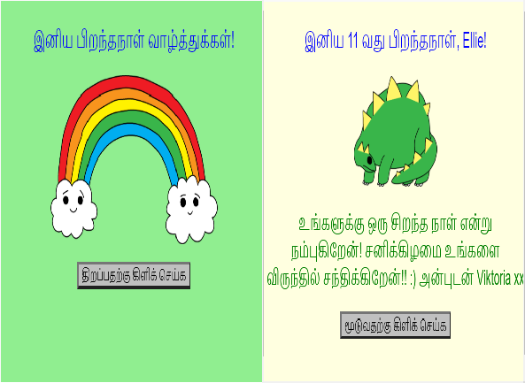
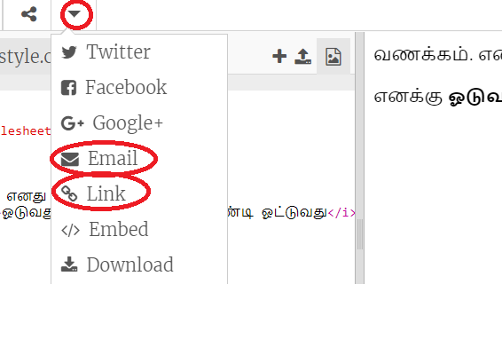

\--- challenge \---

## சவால்: தனிப்பயனாக்கப்பட்ட அட்டையை உருவாக்கவும்

+ Use everything you've learnt about HTML and CSS to finish making a personalised card. And it doesn't have to be a birthday card, it could be one for Christmas or any other occasion!

இங்கே ஓர் எடுத்துக்காட்டு கொடுக்கப்பட்டுள்ளது:

மேலும் பல CSS வண்ண பெயர்களை [இங்கே](http://jumpto.cc/colours){:target="_blank"} காணலாம்.

+ உங்கள் அட்டையை முடித்தவுடன், அதை ஒருவருக்கு பகிரலாம் அல்லது மின்னஞ்சல் செய்யலாம்.

\--- /challenge \---