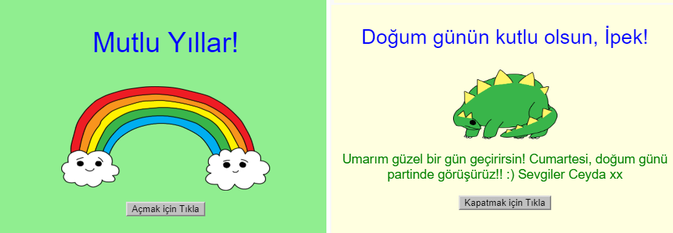

## Giriş

Bu projede, kendi doğum günü kartınızı nasıl yapacağınızı öğrenerek HTML ve CSS ile tanışacaksınız.

### Ne yapacaksınız

Doğum günü kartını açmak için düğmeye tıklayın:

  <iframe src="https://trinket.io/embed/html/c3d52cf65c?outputOnly=true&start=result" width="600" height="450" frameborder="0" marginwidth="0" marginheight="0" allowfullscreen>
  </iframe>
  

### Ne öğreneceksiniz

Bu proje, [Raspberry Pi Digital Making Curriculum](http://rpf.io/curriculum){@ target = "_ blank"} 'un aşağıdaki bölümünden bilgiler kapsamaktadır:

+ [Basit 2D ve 3D varlıklar tasarlama](https://www.raspberrypi.org/curriculum/design/creator){: target = "_ blank"}.

### Eğitimciler için ek bilgiler

Bu projeyi yazdırmanız gerekiyorsa, lütfen [yazıcı-dostu sürüm](https://projects.raspberrypi.org/en/projects/happy-birthday/print) 'ü kullanın {: target = "_ blank"} .

Bu projenin ‘en/resources’ klasöründeki tüm kaynakları (örnek bitmiş bir proje de dahil olmak üzere) içeren GitHub Repo'suna erişmek için altbilgideki bağlantıyı kullanın.