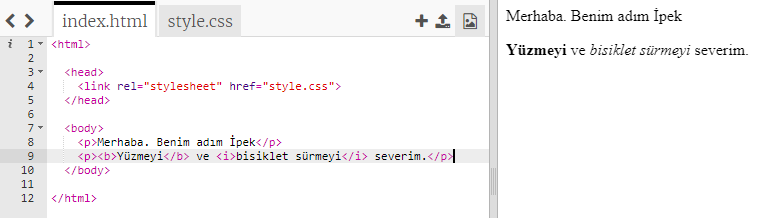
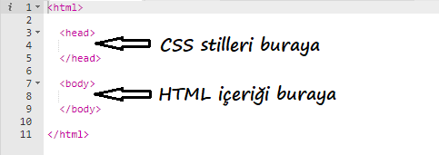
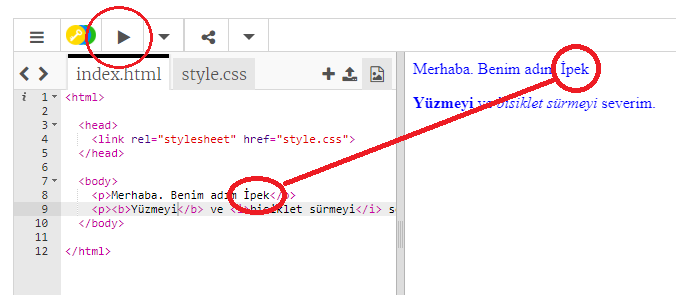
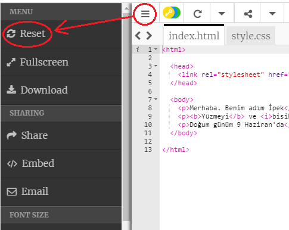
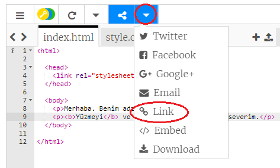
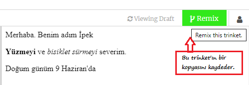

## HTML nedir?

HTML, internet sayfaları oluşturmakta kullanılan bir dil olan **Köprü Metni Biçimlendirme Dili** (Hypertext Markup Language) anlamına gelir. Hadi bir örneğe göz atalım!

HTML kodu yazmak için trinket.io adlı bir internet sitesini kullanacaksınız.

+ [Bu trinketi](http://jumpto.cc/web-intro){:target="_blank"} açın.

Proje şu şekilde gözükmeli:



Solda görebileceğiniz kod HTML'dir. Trinket'ın sağ tarafında ise, HTML kodunun oluşturduğu internet sayfasını görebilirsiniz.

HTML, internet sayfaları oluşturmak için **etiketler** kullanır. Yazdığınız kodun 8. satırında bu HTML kodunu arayın:

```html
<p>Merhaba. Benim adım Andy.</p>
```

`<p>` bir etiket örneğidir ve **paragraf** için kısaltmadır. Paragrafı `<p>` ile başlatabilir ve `</p>` ile sonlandırabilirsiniz.

+ Başka HTML etiketi bulabilir misiniz?

## \--- collapse \---

## title: Cevap

Görmüş olabileceğiniz bir diğer etiket `<b>`, **kalın** anlamına gelir:

```html
<b>running</b>
```

Birkaç tane daha etiket:

+ `<html>` ve `</html>` HTML belgesinin başlangıcını ve sonunu işaret eder
+ `<head>` ve `</head>` CSS gibi şeylerin eklendiği yerdir (daha sonra değineceğiz)
+ `<body>` ve `</body>`, internet sitenizin içeriğinin geçtiği yerdir



\--- /collapse \---

+ HTML dosyasındaki metin paragraflarından birinde (solda) değişiklik yapın. **Çalıştır**'a tıkladığınızda, (sağda) web sayfanızın değiştiğini görmelisiniz!



+ Bir hata yaptıysanız ve tüm değişikliklerinizi geri almak istiyorsanız, **menu** düğmesine ve ardından **Reset** düğmesine tıklayabilirsiniz.



Sadece yaptığınız son işlemi geri almak için ise, `Ctrl` ve `z` tuşlarına birlikte basabilirsiniz.

### Projelerinizi kaydetmek için bir Trinket hesabına ihtiyacınız yok!

Bir Trinket hesabınız yoksa, **aşağı** okuna ve ardından **bağlantıya** tıklayın. Bu size kaydedebileceğiniz ve daha sonra geri dönebileceğiniz bir bağlantı verecektir. Her değişiklik yaptığınızda, bağlantı değişeceğinden bunu tekrar yapmanız gerekecektir!



Eğer bir Trinket hesabınız varsa, internet sayfanızı kaydetmenin en kolay yolu trinket'ın üst kısmındaki **Remix** düğmesine tıklamaktır. Bu trinket'ın bir kopyasını profilinize kaydedecektir.

