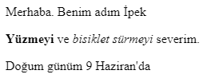

\--- challenge \---

## Meydan Okuma: başka bir paragraf ekleyin

- İnternet sayfanızda, diğer ikisinin altına üçüncü bir metin paragrafı ekleyebilir misiniz?

Yeni paragrafınızın `
` etiketi ile başlaması ve `
` etiketi ile bitmesi gerektiğini unutmayın.

İnternet sayfanız şunun gibi gözükmeli:

Yeni paragrafınıza **kalın** ve <u>altı çizili</u> metin ekleyebilir misiniz? Altı çizili metinler için `<u>` ve `</u>` etiketlerini kullanın.

\--- /challenge \---