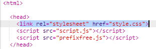
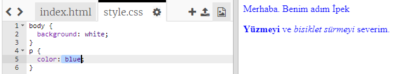

## CSS nedir?

CSS, **Basamaklanmış Stil Katmanları** (Cascading Style Sheets) anlamına gelir, internet sayfalarını şekillendirmek ve güzel görünmelerini sağlamak için kullanılan bir dildir.

+ Bu kod internet sayfanızı bir CSS dosyasına bağlar - HTML belgesinin içinde `<head>` etiketini bulabilecek misiniz bakalım:



CSS, belirli bir etiketin tüm **özelliklerini** listeler.

+ İnternet sayfanızın CSS kodunu görmek için `style.css` sekmesine tıklayın.
    
    

+ Bu kodu bulun:

```html
p {
    color: black;
}
```

Bu CSS kodu, paragrafta (`p`) metin renginin siyah olması gerektiğini söyleyen özelliği belirler. 'color' kelimesinin Amerikan İngilizcesinde yazılmış olduğuna dikkat edin.

+ CSS kodundaki 'black' kelimesini 'blue' olarak değiştirin. Paragraflarda ki tüm metinlerin renginin maviye döndüğünü görmelisiniz.

