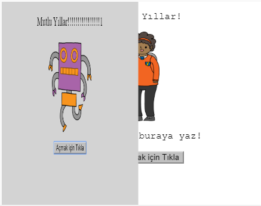
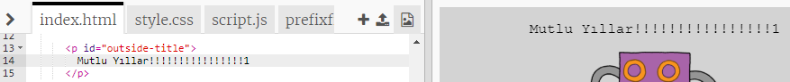
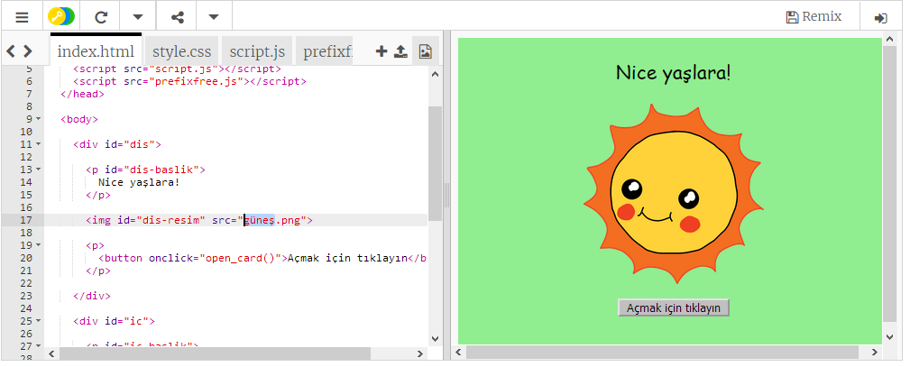
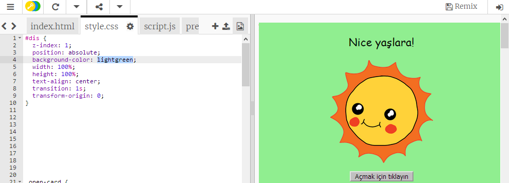
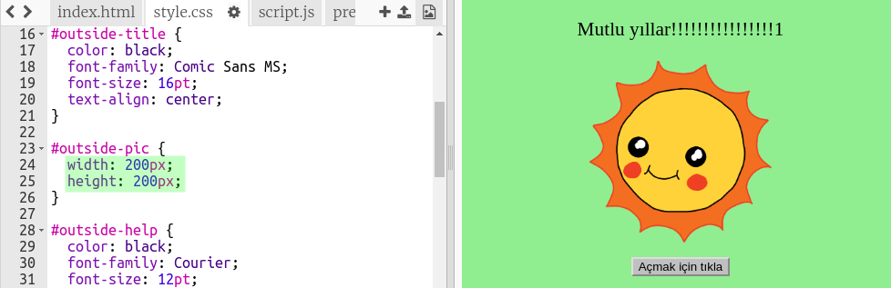

## Doğum günü kartı yapmak

Kendi özel doğum günü kartınızı oluşturmak için HTML ve CSS hakkında öğrendiklerinizi kullanalım.

+ [bu biblo](http://jumpto.cc/web-card)açın {: target = "_ blank"}.

Başlamak için birçok kod yazdık, ancak doğum günü kartı şu ana kadar sıkıcı görünüyor, bu nedenle HTML ve CSS kodunda bazı değişiklikler yapacaksınız.

+ Kartın önündeki düğmeyi tıkladığınızda, içini ortaya çıkarmak için açık görmelisiniz.

+ HTML kodunun 14. satırına gidin. Kartınızı özelleştirmek için metni düzenlemeyi deneyin.

+ Robot resminin HTML kodunu bulabilir ve `robot` - `güneş`kelimesini değiştirebilir misiniz?

\--- ipuçları \--- \--- ipucu \---

+ Kodu bulmak için 17. satıra bakın.
+ `robotu` ila `güneş`kelimesini değiştirin, böylece resim değişimini göreceksiniz!

 \--- / ipucu \--- \--- / ipuçları \---

`çocuk`, `elmas`, `dinozor`, `çiçek`, `kız`, `gökkuşağı`, `robot`, `uzay gemisi`, `güneş`, `çay`veya `ödül kelimesinden herhangi birini kullanabilirsiniz. Bir doğum günü kartı için` ya da `kraker`, `elf`, `penguen`, `mevcut`, `ren geyiği`, `santa`veya `kardan adam` Noel kartı yapmayı tercih ederseniz.

Doğum günü kartının CSS kodunu da düzenleyebilirsiniz.

+ `style.css`için sekmeye tıklayın. İlk bölüm, kartın **dışındaki** için CSS stillerinin tümü.

+ Değiştir `Arka planının rengini` -e doğru `lightgreen`.

+ Bir resmin boyutunu da değiştirebilirsiniz. `# dış-pic` CSS koduna gidin ve dış görüntünün `genişlik` ve `yüksekliğini` `200px` (`piksel` , piksel sayısıdır).

+ Yazı tipi de değiştirilebilir. `# dış başlık` CSS'ye gidin ve `font ailesi` ila `Comic Sans MS` ve `font boyutunu` ila `16 pt`.

Diğer yazı tiplerini kullanabilirsiniz, örneğin:

+ `Arial`
+ `Etki`
+ `Tahoma`