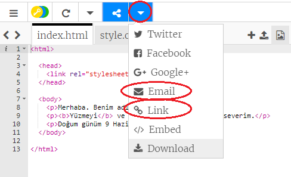

\--- meydan okuma \---

## Mücadelesi: kişiselleştirilmiş bir kart oluşturun

+ Kişiselleştirilmiş bir kart oluşturmayı tamamlamak için HTML ve CSS hakkında öğrendiğiniz her şeyi kullanın. Ve doğum günü kartı olmak zorunda değil, Noel veya başka bir olay için bir tane olabilir!

İşte bir örnek:

Burada daha fazla CSS renk ismi [bulabilirsiniz](http://jumpto.cc/colours){: target = "_ blank"}.

+ Kartınızı bitirdikten sonra, birisine paylaşabilir veya e-postayla gönderebilirsiniz.

\--- /meydan okuma \---