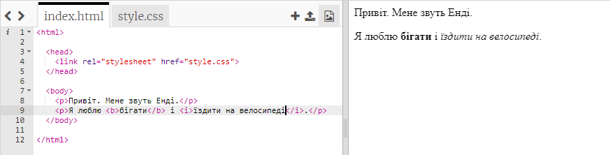
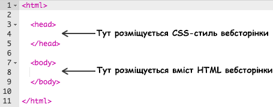
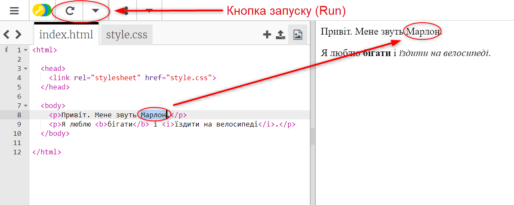
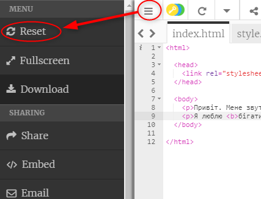
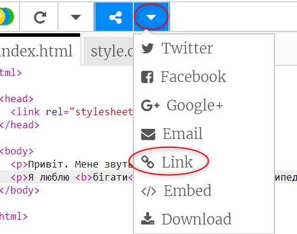
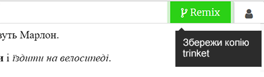

## Що таке HTML?

HTML означає **Мова розмітки гіпертекстових документів**. використовується для створення веб-сторінок. Давайте подивимось на приклад!

Ви використовуватимете сайт trinket.io щоб написати HTML-код.

+ Відкрийте [цей трінкет](http://jumpto.cc/web-intro){:target="_blank"}.

Проект повинен виглядати так:



Код, який ви бачите ліворуч - це HTML. Праворуч від трінкета, ви бачите веб-сторінку, яку зробив цей HTML код.

HTML використовує **теги** для створення веб-сторінок. Шукайте цей HTML код у 8 рядку вашого коду:

```html
<p>Привіт. Я Енді.</p>
```

`<p>` це приклад тегу, і скорочено це **параграф**. Можете починати параграф з`<p>`, і закінчувати з `</p>`.

+ Чи бачите ви інші теги?

## \--- collapse \---

## title: Відповідь

Ще один тег, який ви могли помітити це `<b>`, який означає **жирний**:

```html
<b>працює</b>
```

Ось ще кілька:

+ `<html>`і`</html>` позначають початок та кінець документу HTML
+ `<head>`і`</head>` це місце, де є CSS (до цього ми дійдемо пізніше)
+ `<body>` та `</body>` тут міститься наповнення сайту



\--- /collapse \---

+ Змініть щось в одному з абзаців тексту у документі HTML (ліворуч). Натисніть **Запуск**, і ви маєте побачити зміни на вашій сторінці (праворуч)!



+ Якщо ви зробили помилку і хочете відмінити всі свої зміни, ви можете натиснути **меню**, а потім натиснути **Скинути**.



Щоб скасувати лише останнє, що ви зробили, можна натиснути клавіші ` Ctrl` і `z` одночасно.

### Вам не потрібен обліковий запис Trinket, щоб зберегти ваші проекти!

Якщо у вас немає облікового запису Trinket, натисніть стрілку **вниз** та натисніть **Посилання**. Ви отримаєте посилання, яке можна зберегти, і повернутись пізніше. Вам потрібно буде це робити щоразу після внесення змін, бо посилання зміниться!



Якщо у вас є обліковий запис Trinket, найпростіший спосіб зберегти вашу веб-сторінку - натиснути **Remix** у верхній частині трінкета. Це збереже копію трінкета у вашому профілі.

