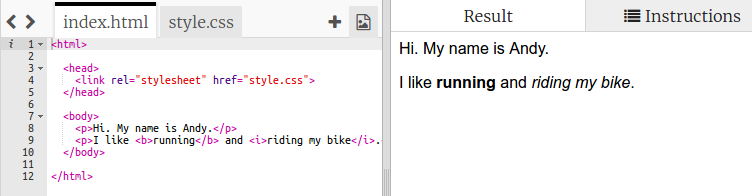

## Що таке HTML?

HTML розшифровується як **Hypertext Markup Language** (мова розмітки гіпертекстових документів), використовується для створення вебсторінок. Давай розглянемо приклад!

Ти будеш використовувати вебсайт trinket.io для написання HTML-коду.

+ Відкрий [цей trinket](http://jumpto.cc/web-intro){:target="_blank"}.

Проєкт повинен виглядати так:



Код, який ти бачиш ліворуч — це HTML. Праворуч ти можеш побачити вебсторінку, створену за допомогою цього HTML-коду.

Для створення вебсторінок HTML використовує **теги.** Зайди цей фрагмент HTML у 8 рядку твого коду:

```html
<p>Привіт. Мене звуть Енді.</p>
```

`<p>` — це приклад тегу, він є скорочення слова **paragraph** (абзац). Можеш починати абзац з тегу `<p>` і закінчувати тегом `</p>`.

+ Чи можеш ти знайти інші теги?

## \--- collapse \---

## title: Відповідь

Ще один тег, який ти міг помітити, — це `<b>`, він означає **bold** (жирний):

```html
<b>бігати</b>
```

Ось ще кілька:

+ `<html>` та `</html>` позначають початок та кінець HTML-документу
+ `<head>` та `</head>` містить такі речі, як CSS (ми повернемося до цього пізніше)
+ `<body>` та `</body>` — тут знаходиться вміст твого вебсайту


\--- /collapse \---

+ Зміни щось в одному з абзаців тексту в HTML-файлі (ліворуч). Натисни **Run** і побачиш зміни на вебсторінці (праворуч)!


+ Якщо ти зробив помилку і хочеш відмінити всі свої зміни, можеш натиснути на кнопку **menu**, а потім **Reset**.


Щоб скасувати лише останню зроблену дію, можна натиснути клавіші `Ctrl` та `z` одночасно.

### Тобі не потрібно мати обліковий запис Trinket для збереження своїх проєктів!

Якщо у тебе немає облікового запису Trinket, натисни на стрілку **вниз**, потім натисни **Link**. Так ти отримаєш посилання, яке можна зберегти, і повернутися до нього пізніше. Тобі потрібно буде робити це щоразу, коли вносиш зміни, оскільки посилання також буде змінюватися!


Якщо у тебе є обліковий запис Trinket, найпростіший спосіб зберегти вебсторінку — натиснути на кнопку **Remix**, яка знаходиться зверху. Це збереже копію цього trinket у твоєму профілі.

