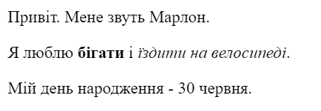

\--- завдання \---

## Завдання: додати ще один абзац

- Зможете додати третій абзац тексту на вашу веб-сторінку під першими двома?

Пам'ятайте, що ваш новий абзац має починатися з тега `
` і закінчитися тегом `
`.

Так може виглядати ця веб-сторінка:

Додайте **жирний** та <u>підкреслений</u> текст у новий абзац? Використовуйте теги `<u>` та `</u>` для підкресленого тексту.

\--- /challenge \---