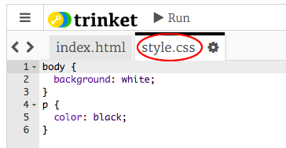
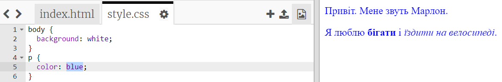

## Що таке CSS?

CSS означає **Cascading Style Sheets** (каскадні таблиці стилів). Це мова, яку використовують для стилізації вебсторінок, та для того, щоб зробити їх приваблими.

+ Цей код пов'язує твою вебсторінку з CSS-файлом — спробуй знайти його в `<head>` HTML-документа:


CSS перераховує всі **властивості** для конкретного тегу.

+ Натисни на вкладку `style.css`, щоб побачити код CSS для твоєї вебсторінки.
    
    

+ Знайди цей код:

```html
p {
    color: black;
}
```

Цей CSS-код визначає властивість абзаців (`p`), яка показує, що колір тексту має бути чорним. Зверни увагу на американське написання: "color".

+ Зміни слово "black" (чорний) в коді CSS на "blue" (синій). Колір тексту всіх абзаців має змінитися на синій.

