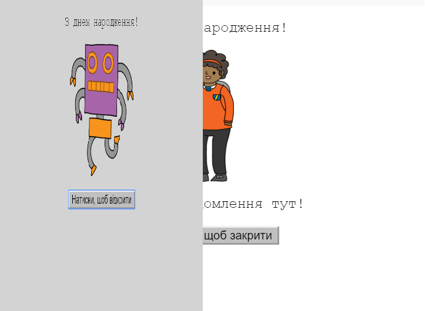
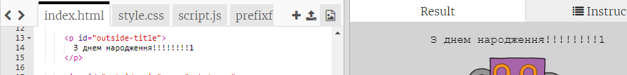
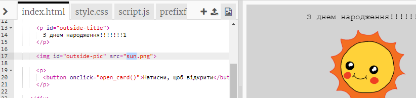
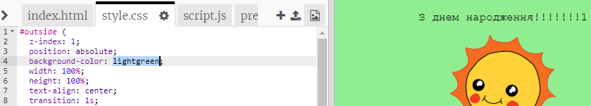
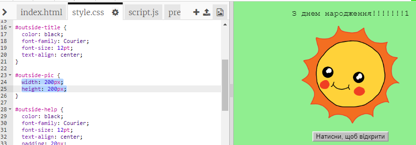
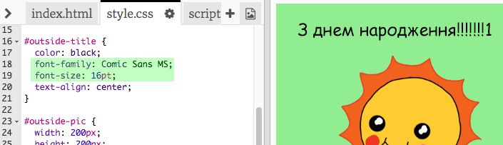

## Створення листівки

Давайте використаємо ваші знання про HTML та CSS для створення вашої власної листівки.

+ Відкрийте [цей трінкет](http://jumpto.cc/web-card){:target="_blank"}.

Ми написали багато коду, щоб почати, але листівка виглядає досить нудно, тому вам потрібно внести деякі зміни в код HTML та CSS.

+ Натисніть кнопку перед листівкою, і вона відкриється, щоб ви побачили середину.

+ Перейдіть до рядка 14 HTML-коду. Спробуйте відредагувати текст, щоб змінити листівку.

+ Зможете знайти HTML-код для картинки робота і змінити слово `robot` на `sun`?

\--- hints \--- \--- hint \---

+ Дивіться на рядок 17, щоб знайти код.
+ Змініть слово `robot` на `sun` і побачите як змінюється картинка!

 \--- /hint \--- \--- /hints \---

Використовуйте будь-яке з слів `boy`, `diamond`, `dinosaur`, `flowers`, `girl`, `rainbow`, `robot`, `spaceship`, `sun`, `tea`, or `trophy` for a birthday card, or `cracker`, `elf`, `penguin`, `present`, `reindeer`, `santa`, or `snowman`, якщо хочете зробити різдвяну листівку.

Ви також можете редагувати код CSS листівки.

+ Клацніть на вкладку `style.css`. Перша частина - це всі стилі CSS для **outside** листівки.

+ Змініть `background-color` на `lightgreen`.

+ Ви також можете змінити розмір картинки. Перейдіть на код `#outside-pic` CSS і змініть `width` та `height` зовнішньої картинки на `200px` (`px` означає пікселі).

+ Можна також змінити шрифт. Перейдіть до `#outside-title` CSS і змініть `font-family` на `Comic Sans MS` та `font-size` на `16pt`.

Ви можете використовувати інші шрифти, наприклад:

+ `arial`
+ `Impact`
+ `Tahoma`