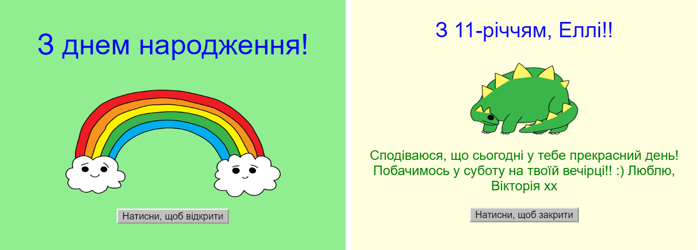
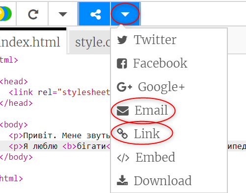

\--- challenge \---

## Завдання: створити свою листівку

+ Використовуйте все, що ви дізналися про HTML та CSS, щоб створити особливу листівку. Це не мусить бути листівка для дня народження, це може бути для Різдва чи для будь-якої причини!

Ось приклад:

Більше назв кольорів CSS [тут](http://jumpto.cc/colours){:target="_blank"}.

+ Коли ви закінчите свою листівку, можете поділитися чи надіслати її.

\--- /challenge \---